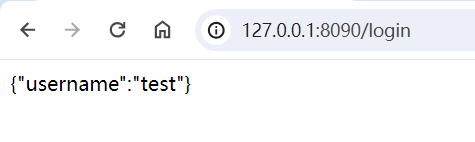
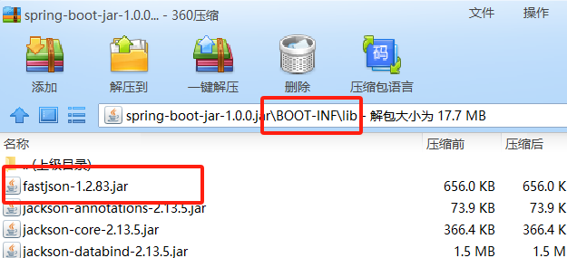
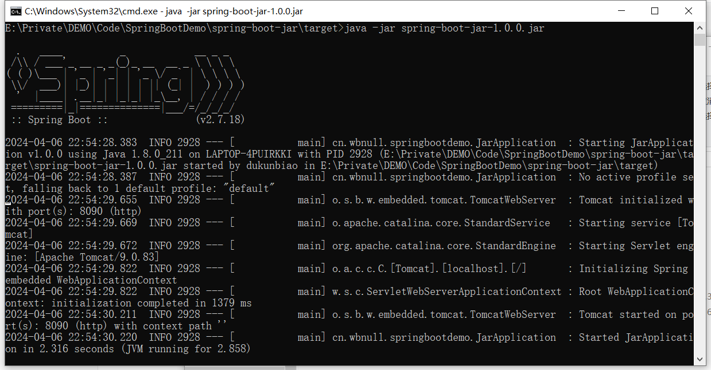

# 0 开发环境

- JDK：1.8
- Spring Boot：2.7.18

# 1 放置jar

将需要引入的jar放置到项目中

# 2 引入依赖

~~~xml
<!-- groupId artifactId version 可以随便写 -->
<!-- scope 配置为system表示此依赖是外部jar，非Maven仓库 -->
<!-- scope 配置为system时，systemPath生效，systemPath为外部jar路径 -->
<!-- ${project.basedir} 表示当前模块根目录。-->
<dependency>
    <groupId>com.alibaba</groupId>
    <artifactId>fastjson</artifactId>
    <version>1.2.83</version>
    <scope>system</scope>
    <systemPath>${project.basedir}/lib/fastjson-1.2.83.jar</systemPath>
</dependency>
~~~

# 3 测试

新建 application.yml和Spring Boot启动类

## 3.1 新建测试类

~~~java
@RestController
public class LoginController {

    @GetMapping(value = "login")
    public String login() {
        JSONObject params = new JSONObject();
        params.put("username", "test");

        return params.toString();
    }
}
~~~

## 3.2 测试

浏览器访问127.0.0.1:8090/login，返回结果如下

测试通过，项目已经成功引入外部jar，并可使用其中的方法。

但这仅仅是引入到项目中，打包的时候不会将该外部jar打包到spring boot的jar/war包中。还需如下配置

# 4 配置打包规则

~~~xml
<build>
    <plugins>
        <plugin>
            <groupId>org.springframework.boot</groupId>
            <artifactId>spring-boot-maven-plugin</artifactId>
            <configuration>
                <!-- 包含systemPath指定的依赖 -->
                <includeSystemScope>true</includeSystemScope>
            </configuration>
        </plugin>
    </plugins>
</build>
~~~

# 5 测试

maven打包，使用压缩方式打开jar包，**BOOT-INF\lib**目录下包含systemPath指定的依赖

使用脚本启动服务，启动成功

~~~bat
java -jar spring-boot-jar-1.0.0.jar
~~~

浏览器访问127.0.0.1:8090/login，返回结果如下

测试通过，项目已经成功打包

---

CSDN：[https://blog.csdn.net/dkbnull/article/details/137441600](https://blog.csdn.net/dkbnull/article/details/137441600)

微信：[https://mp.weixin.qq.com/s/nz5fmX3cogG0gX8UIm3nww](https://mp.weixin.qq.com/s/nz5fmX3cogG0gX8UIm3nww)

知乎：[https://zhuanlan.zhihu.com/p/690993440](https://zhuanlan.zhihu.com/p/690993440)

---

