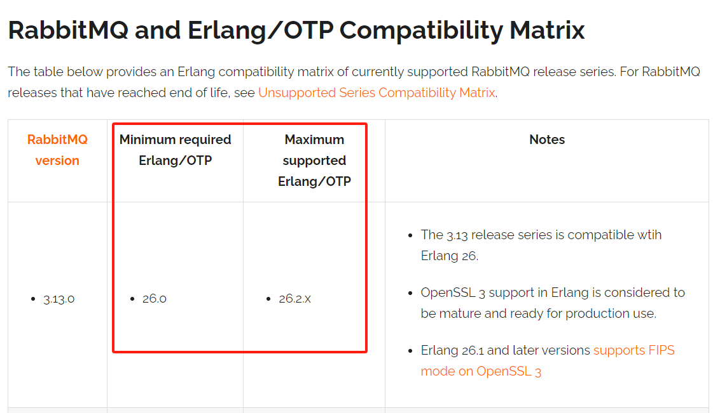
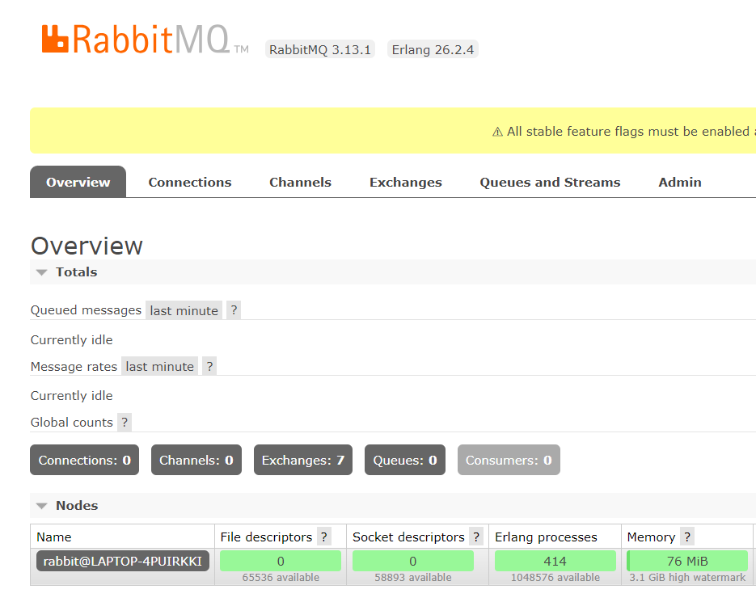

# 0 开发环境

- JDK：1.8
- Spring Boot：2.7.18
- RabbitMQ：3.13.1
- Erlang：26.2.4

# 1 安装RabbitMQ

## 1.1 安装RabbitMQ

下载地址：[https://www.rabbitmq.com/docs/download](https://www.rabbitmq.com/docs/download)

Windows下载地址：[https://github.com/rabbitmq/rabbitmq-server/releases/download/v3.13.1/rabbitmq-server-3.13.1.exe](https://github.com/rabbitmq/rabbitmq-server/releases/download/v3.13.1/rabbitmq-server-3.13.1.exe)

因为RabbitMQ依赖Erlang，所以下载完成后先不要安装，先在 [https://www.rabbitmq.com/docs/which-erlang](https://www.rabbitmq.com/docs/which-erlang) 查看所需的Erlang版本，下载对应Erlang安装包

## 1.2 安装Erlang

Erlang下载地址：[https://www.erlang.org/downloads](https://www.erlang.org/downloads)

依次安装Erlang、RabbitMQ

计算机服务中会出现RabbitMQ服务，直接右键启动即可。

也可在开始菜单中找到**RabbitMQ Server目录**，点击**RabbitMQ Service - start**启动

## 1.3 启用RabbitMQ管理界面

默认情况下，RabbitMQ没有启用web端客户端插件，需要启用才可以生效

参考文档：[https://www.rabbitmq.com/docs/management](https://www.rabbitmq.com/docs/management)

进入到RabbitMQ安装目录下 **RabbitMQ Server\rabbitmq_server-3.13.1\sbin** 执行命令

~~~bat
rabbitmq-plugins enable rabbitmq_management
~~~

安装成功，**重启RabbitMQ服务**，浏览器访问 **127.0.0.1:15672**

默认账号密码都是**guest**，登录成功后界面如下

# 2 广播模式Fanout

Fanout，发布订阅模式，是一种广播机制，是没有路由key的模式。

## 2.1 新建生产者

新建module **spring-boot-rabbitmq-producer**

### 2.1.1 引入依赖

~~~xml
<dependency>
    <groupId>org.springframework.boot</groupId>
    <artifactId>spring-boot-starter-amqp</artifactId>
</dependency>
~~~

### 2.1.2 配置RabbitMQ

~~~yml
server:
  port: 8090
#
#配置RabbitMQ服务
spring:
  rabbitmq:
    username: guest
    password: guest
    virtual-host: /
    host: 127.0.0.1
    port: 5672
~~~

### 2.1.3 新建配置类

~~~java
@Configuration
public class RabbitMqFanoutConfig {

    /**
     * Fanout 交换机
     *
     * @return
     */
    @Bean
    public FanoutExchange fanoutExchange() {
        return new FanoutExchange("fanout_user_exchange", true, false);
    }

    /**
     * 发送短信队列
     *
     * @return
     */
    @Bean
    public Queue smsQueue() {
        //durable       是否持久化，默认为false
        //exclusive     是否只能被当前创建的连接使用，默认为false
        //autoDelete    是否自动删除，默认为false

        //一般设置队列的持久化，其余两个默认false
        return new Queue("sms.fanout.queue", true);
    }

    /**
     * 发送邮件队列
     *
     * @return
     */
    @Bean
    public Queue emailQueue() {
        return new Queue("email.fanout.queue", true);
    }

    /**
     * 发送微信队列
     *
     * @return
     */
    @Bean
    public Queue wechatQueue() {
        return new Queue("wechat.fanout.queue", true);
    }

    /**
     * 将队列和交换机绑定
     *
     * @return
     */
    @Bean
    public Binding smsBindingFanout() {
        return BindingBuilder.bind(smsQueue()).to(fanoutExchange());
    }

    @Bean
    public Binding emailBindingFanout() {
        return BindingBuilder.bind(emailQueue()).to(fanoutExchange());
    }

    @Bean
    public Binding wechatBindingFanout() {
        return BindingBuilder.bind(wechatQueue()).to(fanoutExchange());
    }
}
~~~

### 2.1.4 新建生产者服务

~~~java
@Service
public class UserService {

    @Autowired
    private RabbitTemplate rabbitTemplate;

    public void register(String username, String password) {
        //模拟用户注册
        String userId = UUID.randomUUID().toString();

        //saveUser(user);

        //发送用户信息给RabbitMQ fanout
        rabbitTemplate.convertAndSend("fanout_user_exchange", "", userId + username);
    }
}
~~~

### 2.1.5 新建测试类

~~~java
@SpringBootTest(classes = RabbitMqProducerApplication.class, webEnvironment = SpringBootTest.WebEnvironment.DEFINED_PORT)
public class RabbitMqProducerApplicationTest {

    @Autowired
    private UserService userService;

    @Test
    public void contextLoads() {
        userService.register("张三", "zhangsan");
    }
}
~~~

启动测试类，执行成功，查看RabbitMQ Web页面，成功绑定，且各存在一条消息

## 2.2 新建消费者

新建module **spring-boot-rabbitmq-consumer**

### 2.2.1 引入依赖

~~~xml
<dependency>
    <groupId>org.springframework.boot</groupId>
    <artifactId>spring-boot-starter-amqp</artifactId>
</dependency>
~~~

### 2.2.2 配置RabbitMQ

~~~yml
server:
  port: 8090
#
#配置RabbitMQ服务
spring:
  rabbitmq:
    username: guest
    password: guest
    virtual-host: /
    host: 127.0.0.1
    port: 5672
~~~

### 2.2.3 新建短信消费服务

~~~java
@RabbitListener(queues = "sms.fanout.queue")
@Service
public class FanoutSmsService {

    /**
     * 消息接收的方法
     *
     * @param message
     */
    @RabbitHandler
    public void receiveMessage(String message) {
        //发送短信

        System.out.println("sms.fanout：" + message);
    }
}
~~~

### 2.2.4 新建邮件消费服务

~~~java
@RabbitListener(queues = "email.fanout.queue")
@Service
public class FanoutEmailService {

    /**
     * 消息接收的方法
     *
     * @param message
     */
    @RabbitHandler
    public void receiveMessage(String message) {
        //发送邮件

        System.out.println("email.fanout：" + message);
    }
}
~~~

### 2.2.5 新建微信消费服务

~~~java
@RabbitListener(queues = "wechat.fanout.queue")
@Service
public class FanoutWechatService {

    /**
     * 消息接收的方法
     *
     * @param message
     */
    @RabbitHandler
    public void receiveMessage(String message) {
        //推送微信消息

        System.out.println("wechat.fanout：" + message);
    }
}
~~~

## 2.3 测试

新建启动类，启动服务，控制台输出如下，消费者成功接收到消息

RabitMQ中消息为0

再次执行生产者测试类发送新的消息，消费者成功接收并打印

# 3 路由模式Direct

有routing-key的匹配模式，Direct模式是Fanout模式上的一种叠加，增加了路由RoutingKey的模式。

## 3.1 消费者

### 3.1.1 新建短信消费服务

这里，我们不在生产者中使用配置类来绑定交换机和队列了，直接在消费者中使用注解来绑定

使用 **@RabbitListener(bindings = @QueueBinding())** 注解来绑定交换机和队列

* bindings 用来确定队列和交换机的绑定关系
* value    队列名称，与生产者对应
* exchange 交换机名称，与生产者对应；type设置RabbitMQ模式，默认为direct
* key      路由key

但有些高级用法，还是推荐使用配置类

~~~java
@RabbitListener(bindings = @QueueBinding(
        value = @Queue(value = "sms.direct.queue", durable = "true", autoDelete = "false"),
        exchange = @Exchange(value = "direct_user_exchange", type = ExchangeTypes.DIRECT),
        key = "sms"))
@Service
public class DirectSmsService {

    /**
     * 消息接收的方法
     *
     * @param message
     */
    @RabbitHandler
    public void receiveMessage(String message) {
        //发送短信

        System.out.println("sms.direct：" + message);
    }
}
~~~

### 3.1.2 新建邮件消费服务

~~~java
@RabbitListener(bindings = @QueueBinding(
        value = @Queue(value = "email.direct.queue", durable = "true", autoDelete = "false"),
        exchange = @Exchange(value = "direct_user_exchange"),
        key = "email"))
@Service
public class DirectEmailService {

    /**
     * 消息接收的方法
     *
     * @param message
     */
    @RabbitHandler
    public void receiveMessage(String message) {
        //发送邮件

        System.out.println("email.direct：" + message);
    }
}
~~~

### 3.1.3 新建微信消费服务

~~~java
@RabbitListener(bindings = @QueueBinding(
        value = @Queue(value = "wechat.direct.queue", durable = "true", autoDelete = "false"),
        exchange = @Exchange(value = "direct_user_exchange"),
        key = "wechat"))
@Service
public class DirectWechatService {

    /**
     * 消息接收的方法
     *
     * @param message
     */
    @RabbitHandler
    public void receiveMessage(String message) {
        //推送微信消息

        System.out.println("wechat.direct：" + message);
    }
}
~~~

## 3.2 生产者

### 3.2.1 调整服务类

~~~java
@Service
public class UserService {

    @Autowired
    private RabbitTemplate rabbitTemplate;

	//...

    public void registerDirect(String username, String password) {
        //模拟用户注册
        String userId = UUID.randomUUID().toString();

        //saveUser(user);

        rabbitTemplate.convertAndSend("direct_user_exchange", "sms", userId + username);
        rabbitTemplate.convertAndSend("direct_user_exchange", "email", userId + username);
    }
}
~~~

### 3.2.2 调整测试类

~~~java
@SpringBootTest(classes = RabbitMqProducerApplication.class, webEnvironment = SpringBootTest.WebEnvironment.DEFINED_PORT)
public class RabbitMqProducerApplicationTest {

    @Autowired
    private UserService userService;

    @Test
    public void contextLoads() {
        userService.register("张三", "zhangsan");
    }

    @Test
    public void contextLoadsDirect() {
        userService.registerDirect("李四", "lisi");
    }
}
~~~

## 3.3 测试

启动消费者服务，执行生产者测试类contextLoadsDirect，消费者成功收到消息并打印

# 4 主题模式Topic

模糊的routing-key的匹配模式，Topic模式是Direct模式上的一种叠加，增加了模糊路由RoutingKey的模式。

## 4.1 消费者

### 4.1.1 新建配置类

一般在生产中，先启动消费者服务，再启动生产者服务，因此我们通常把配置类放在消费者服务中，否则可能导致无队列监听而服务启动失败或报错

~~~java
@Configuration
public class RabbitMqTopicConfig {

    /**
     * Topic 交换机
     *
     * @return
     */
    @Bean
    public TopicExchange topicExchange() {
        return new TopicExchange("topic_user_exchange", true, false);
    }

    /**
     * 发送短信队列
     *
     * @return
     */
    @Bean
    public Queue smsQueue() {
        //durable       是否持久化，默认为false
        //exclusive     是否只能被当前创建的连接使用，默认为false
        //autoDelete    是否自动删除，默认为false

        //一般设置队列的持久化，其余两个默认false
        return new Queue("sms.topic.queue", true);
    }

    /**
     * 发送邮件队列
     *
     * @return
     */
    @Bean
    public Queue emailQueue() {
        return new Queue("email.topic.queue", true);
    }

    /**
     * 发送微信队列
     *
     * @return
     */
    @Bean
    public Queue wechatQueue() {
        return new Queue("wechat.topic.queue", true);
    }

    /**
     * 将队列和交换机绑定, 并设置用于匹配键
     *
     * @return
     */
    @Bean
    public Binding smsBindingTopic() {
        return BindingBuilder.bind(smsQueue()).to(topicExchange()).with("*.sms.#");
    }

    @Bean
    public Binding emailBindingTopic() {
        return BindingBuilder.bind(emailQueue()).to(topicExchange()).with("#.email.#");
    }

    @Bean
    public Binding wechatBindingTopic() {
        return BindingBuilder.bind(wechatQueue()).to(topicExchange()).with("#.wechat.*");
    }
}
~~~

### 4.1.2 新建短信消费服务

~~~java
@RabbitListener(queues = "sms.topic.queue")
@Service
public class TopicSmsService {

    /**
     * 消息接收的方法
     *
     * @param message
     */
    @RabbitHandler
    public void receiveMessage(String message) {
        //发送短信

        System.out.println("sms.topic：" + message);
    }
}
~~~

### 4.1.3 新建邮件消费服务

~~~java
@RabbitListener(queues = "email.topic.queue")
@Service
public class TopicEmailService {

    /**
     * 消息接收的方法
     *
     * @param message
     */
    @RabbitHandler
    public void receiveMessage(String message) {
        //发送邮件

        System.out.println("email.topic：" + message);
    }
}
~~~

### 4.1.4 新建微信消费服务

~~~java
@RabbitListener(queues = "wechat.topic.queue")
@Service
public class TopicWechatService {

    /**
     * 消息接收的方法
     *
     * @param message
     */
    @RabbitHandler
    public void receiveMessage(String message) {
        //推送微信消息

        System.out.println("wechat.topic：" + message);
    }
}
~~~

## 4.2 生产者

### 4.2.1 调整服务类

~~~java
    public void registerTopic(String username, String password) {
        //模拟用户注册
        String userId = UUID.randomUUID().toString();

        //saveUser(user);

        rabbitTemplate.convertAndSend("topic_user_exchange", "*.sms.email.*", userId + username);
    }
~~~

### 4.2.2 调整测试类

~~~java
    @Test
    public void contextLoadsTopic() {
        userService.registerTopic("王五", "wangwu");
    }
~~~

## 4.3 测试

启动消费者服务，执行生产者测试类contextLoadsTopic，消费者成功收到消息并打印

# 5 设置过期时间

## 5.1 调整消费者配置类

**调整RabbitMqTopicConfig**

~~~java
    /**
     * durable         创建持久化队列phone.topic.queue
     * withArgument    设置消息过期时间60000毫秒
     *
     * @return
     */
    @Bean
    public Queue phoneQueue() {
        return QueueBuilder.durable("phone.topic.queue").withArgument("x-message-ttl", 60000).build();
    }

    @Bean
    public Binding phoneBindingTopic() {
        return BindingBuilder.bind(phoneQueue()).to(topicExchange()).with("#.phone.#");
    }
~~~

## 5.2 测试

启动服务，RabitMQ中队列如下，队列标识为TTL

# 6 消息确认机制

**以下均为生产者module的调整**

## 6.1 调整生产者yml

~~~yml
server:
  port: 8090
#
#配置RabbitMQ服务
spring:
  rabbitmq:
    username: guest
    password: guest
    virtual-host: /
    host: 127.0.0.1
    port: 5672
    #none 禁用发布确认模式，默认值
    #correlated 消息成功发布到交换机后会触发回调方法
    publisher-confirm-type: correlated
~~~

## 6.2 新建回调方法

~~~java
public class MessageConfirmCallback implements RabbitTemplate.ConfirmCallback {

    @Override
    public void confirm(CorrelationData correlationData, boolean b, String s) {
        if (b) {
            System.out.println("消息确认成功");
        } else {
            System.out.println("消息确认失败");
        }
    }
}
~~~

## 6.3 调整服务类

~~~java
    public void registerTopicCallback(String username, String password) {
        //模拟用户注册
        String userId = UUID.randomUUID().toString();

        //saveUser(user);

        //设置消息确认
        rabbitTemplate.setConfirmCallback(new MessageConfirmCallback());
        rabbitTemplate.convertAndSend("topic_user_exchange", "*.sms.email.*", userId + username);
    }
~~~

## 6.4 调整测试类

~~~java
    @Test
    public void contextLoadsTopicCallback() {
        userService.registerTopicCallback("周六", "zhouliu");
    }
~~~

执行测试类contextLoadsTopicCallback，成功进入回调方法

# 7 死信队列

DLX（Dead-Letter-Exchange），称为死信交换机或死信邮箱。

当消息在一个队列中变成死信（dead message）之后，它能被重新发送到另一个交换机中，这个交换机就是DLX ，绑定DLX的队列就是死信队列。

消息变成死信，可能是由于以下的原因：

- 消息被拒绝
- 消息过期
- 队列达到最大长度

DLX也是一个正常的交换机，和一般的交换机没有区别，它能在任何的队列上被指定，实际上就是设置某一个队列的属性。

当这个队列中存在死信时，RabbitMQ就会自动将这个消息重新发布到设置的DLX上去，进而被路由到另一个队列，即死信队列。

在定义队列的时候设置队列参数 `x-dead-letter-exchange` 指定交换机即可设置为死信队列。

## 7.1 调整消费者配置类

**调整RabbitMqTopicConfig**

~~~java
    @Bean
    public Queue dlxQueue() {
        return new Queue("dlx.topic.queue", true);
    }

    @Bean
    public Queue vipQueue() {
        return QueueBuilder.durable("vip.topic.queue")
                .withArgument("x-message-ttl", 60000)
                .withArgument("x-dead-letter-exchange", "dlx.topic.queue")
                .build();
    }

    @Bean
    public Binding dlxBindingTopic() {
        return BindingBuilder.bind(dlxQueue()).to(topicExchange()).with("#.#");
    }

    @Bean
    public Binding vipBindingTopic() {
        return BindingBuilder.bind(vipQueue()).to(topicExchange()).with("#.vip.#");
    }
~~~

## 7.2 测试

启动服务，RabitMQ中队列如下，队列标识为DLX

## 7.3 调整生产者服务类

~~~java
    public void registerTopicDlx(String username, String password) {
        //模拟用户注册
        String userId = UUID.randomUUID().toString();

        //saveUser(user);

        rabbitTemplate.convertAndSend("topic_user_exchange", "*.vip.*", userId + username);
    }
~~~

## 7.4 调整生产者测试类

~~~java
    @Test
    public void contextLoadsTopicDlx() {
        userService.registerTopicDlx("钱七", "qianqi");
    }
~~~

## 7.5 测试

**关闭消费者服务**，执行生产者测试类contextLoadsTopicDlx

未过期前

过期后

## 7.6 新建死信消费服务

消费者新建

~~~java
@RabbitListener(queues = "dlx.topic.queue")
@Service
public class TopicDlxService {

    /**
     * 消息接收的方法
     *
     * @param message
     */
    @RabbitHandler
    public void receiveMessage(String message) {
        System.out.println("dlx.topic：" + message);
    }
}
~~~

## 7.7 测试

再启动消费者服务，成功接收死信队列中消息

RabbitMQ中消息队列如下

至此，SpringBoot成功整合RabbitMQ且测试通过，集群、分布式事务等用法敬请等待后续。

---

GitHub：[https://github.com/dkbnull/spring-boot-demo](https://github.com/dkbnull/spring-boot-demo)

Gitee：[https://gitee.com/dkbnull/spring-boot-demo](https://gitee.com/dkbnull/spring-boot-demo)

CSDN：[https://blog.csdn.net/dkbnull/article/details/137995945](https://blog.csdn.net/dkbnull/article/details/137995945)

微信：[https://mp.weixin.qq.com/s/6xOiydFbnLCeTOT-6fRmFA](https://mp.weixin.qq.com/s/6xOiydFbnLCeTOT-6fRmFA)

知乎：[https://zhuanlan.zhihu.com/p/693568872](https://zhuanlan.zhihu.com/p/693568872)

---