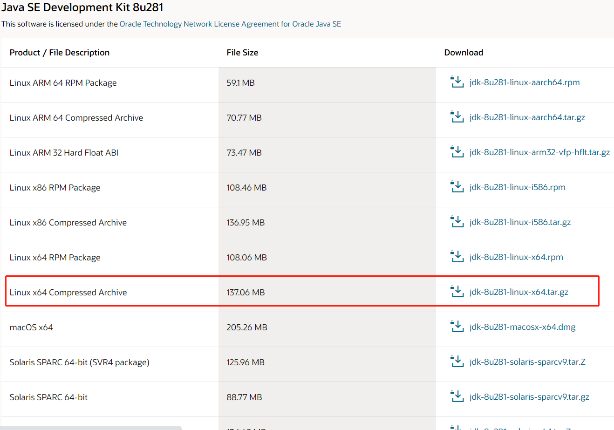
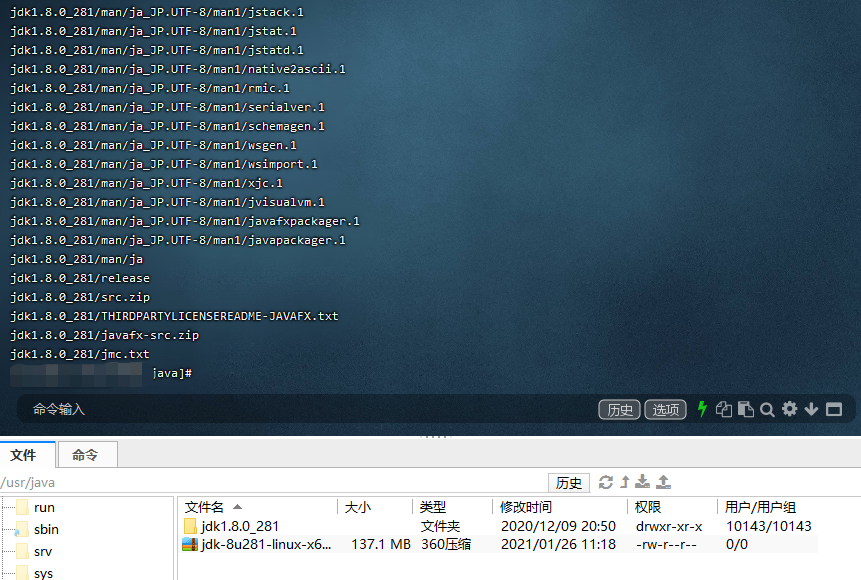
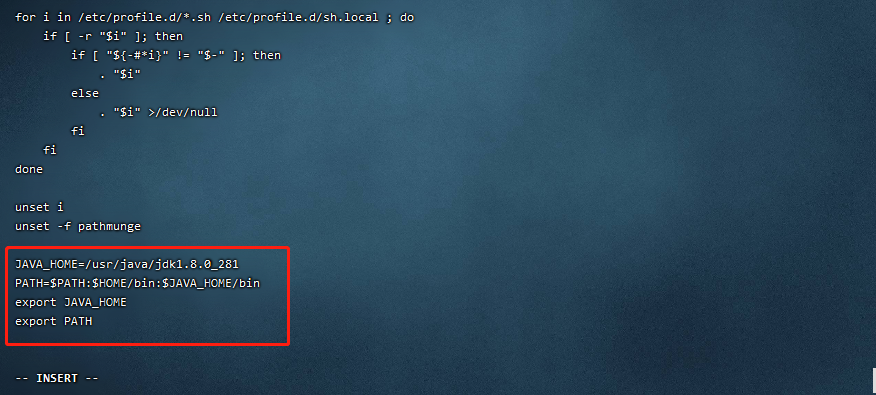
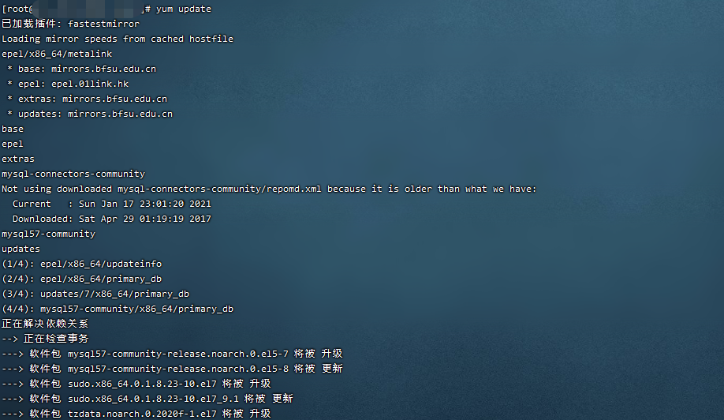
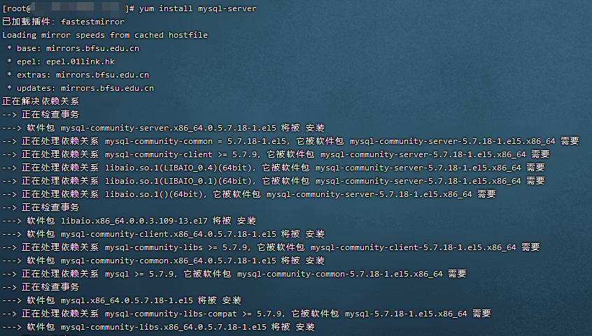
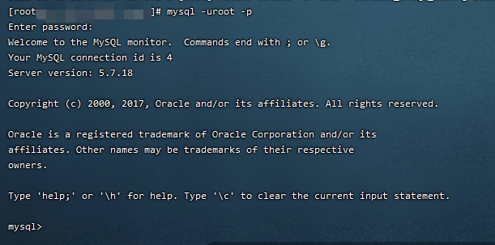
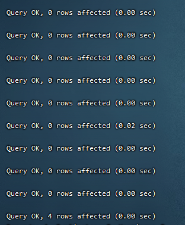

## 0. 工具

使用 **FinalShell** 连接Linux服务器

## 1. 安装JDK

**1.1 下载对应系统 JDK安装包**



**1.2 创建 JDK安装目录**

~~~shell
cd /usr/
mkdir java
cd java
~~~

**1.3 将 JDK安装包上传到服务器**


**1.4 解压 JDK安装包**

~~~shell
tar -zxvf jdk-8u281-linux-x64.tar.gz
~~~



**1.5 配置环境变量**

~~~shell
vi /etc/profile
~~~

**按 i 进入编辑模式，在文件最后加上**

~~~shell
JAVA_HOME=/usr/java/jdk1.8.0_281
PATH=$PATH:$HOME/bin:$JAVA_HOME/bin
export JAVA_HOME
export PATH
~~~



**按ESC退出编辑模式**

**输入:wq保存并退出**

**1.6 使用source /etc/profile配置生效**

~~~shell
source /etc/profile
~~~
**1.7 检查环境变量是否生效**

~~~shell
java -version
~~~


到此，JDK安装完成，环境变量已生效。

## 2. 安装MySQL

**2.1 安装前，可以先检测系统是否已安装了 MySQL**

```shell
rpm -qa | grep mysql
```

**2.2 如果系统已安装，可以进行卸载**

```
rpm -e --nodeps mysql
```
**2.3 安装 MySQL**

~~~shell
wget http://repo.mysql.com/mysql57-community-release-el5-7.noarch.rpm
~~~


~~~shell
rpm -ivh mysql57-community-release-el5-7.noarch.rpm
~~~


~~~shell
yum update
~~~



~~~shell
yum install mysql-server
~~~



**2.4 设置权限**

```shell
chown mysql:mysql -R /var/lib/mysql
```

**2.5 初始化 MySQL**

```shell
mysqld --initialize
```

**2.6 设置权限**

~~~shell
chmod -R 777 /var/lib/mysql
~~~

**2.7 启动 MySQL**

```sh
systemctl start mysqld
```

**2.8 查看 MySQL 运行状态**

```shell
systemctl status mysqld
```

启动成功


**2.9 查看版本信息**

~~~shell
mysqladmin --version
~~~


**2.10 查看初始化密码**

~~~shell
cat /var/log/mysqld.log | grep password
~~~


**2.11 连接 MySQL服务器**



**2.12 修改密码**

~~~mysql
set password for root@localhost = password('root');
~~~

**2.13 建库建表导入数据**

我们将数据文件放置到/usr/mysql/目录下

~~~sql
create database test;
use test;
set names utf8mb4;
source /usr/mysql/test.sql;
~~~

导入成功



## 3. 部署Spring Boot服务

**3.1 在服务器上创建Spring Boot服务放置目录**

~~~shell
cd /usr/
mkdir test
cd test
~~~

**3.2 上传Spring Boot服务到该目录**

**3.3 启动服务**

~~~shell
java -jar test-1.0.0.1.jar
~~~


## 附

如果启动 MySQL服务报错

~~~shell
Job for mysqld.service failed because the control process exited with error code. See "systemctl status mysqld.service" and "journalctl -xe" for details.
~~~

我们使用 **systemctl status mysqld.service** 查看更多信息

~~~shell
● mysqld.service - SYSV: MySQL database server.
   Loaded: loaded (/etc/rc.d/init.d/mysqld; bad; vendor preset: disabled)
   Active: failed (Result: exit-code) since 一 2021-02-01 17:45:55 CST; 2s ago
     Docs: man:systemd-sysv-generator(8)
  Process: 13969 ExecStart=/etc/rc.d/init.d/mysqld start (code=exited, status=1/FAILURE)

2月 01 17:45:54 ecs-433d-0001 systemd[1]: Starting SYSV: MySQL database server....
2月 01 17:45:55 ecs-433d-0001 mysqld[13969]: MySQL Daemon failed to start.
2月 01 17:45:55 ecs-433d-0001 mysqld[13969]: Starting mysqld:  [FAILED]
2月 01 17:45:55 ecs-433d-0001 systemd[1]: mysqld.service: control process exited, code=exited status=1
2月 01 17:45:55 ecs-433d-0001 systemd[1]: Failed to start SYSV: MySQL database server..
2月 01 17:45:55 ecs-433d-0001 systemd[1]: Unit mysqld.service entered failed state.
2月 01 17:45:55 ecs-433d-0001 systemd[1]: mysqld.service failed.
~~~

进一步查看日志

~~~shell
vi /var/log/mysqld.log
~~~
日志如下：
~~~
2021-02-01T09:31:14.962922Z 0 [ERROR] InnoDB: The innodb_system data file 'ibdata1' must be writable
2021-02-01T09:31:14.962935Z 0 [ERROR] InnoDB: The innodb_system data file 'ibdata1' must be writable
2021-02-01T09:31:14.962939Z 0 [ERROR] InnoDB: Plugin initialization aborted with error Generic error
2021-02-01T09:31:15.563406Z 0 [ERROR] Plugin 'InnoDB' init function returned error.
2021-02-01T09:31:15.563426Z 0 [ERROR] Plugin 'InnoDB' registration as a STORAGE ENGINE failed.
2021-02-01T09:31:15.563431Z 0 [ERROR] Failed to initialize plugins.
2021-02-01T09:31:15.563439Z 0 [ERROR] Aborting
~~~

错误信息为 **The innodb_system data file 'ibdata1' must be writable**

~~~shell
chmod -R 777 /var/lib/mysql
~~~


---

CSDN：[https://blog.csdn.net/dkbnull/article/details/113574249](https://blog.csdn.net/dkbnull/article/details/113574249)

微信：[https://mp.weixin.qq.com/s/9Fflre540JLqSwr4Ve1KJA](https://mp.weixin.qq.com/s/9Fflre540JLqSwr4Ve1KJA)

---

