# 1 查看未挂载的磁盘

命令：

~~~shell
fdisk -l
~~~

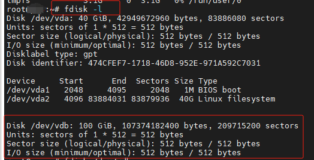

红框圈中的即是本次要挂载的磁盘，/dev/vdb 与 /dev/vda 相比，其没有下方的 /dev/vda1 等信息，代表 /dev/vdb 磁盘并没有进行过分区操作，是一个新加的硬盘。

# 2 对新建的磁盘进行分区和格式化

## 2.1 分区

命令：

~~~shell
fdisk /dev/vdb
~~~

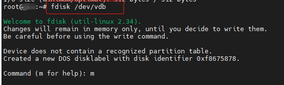

显示Command (m for help): ，输入 **m** 可查看帮助

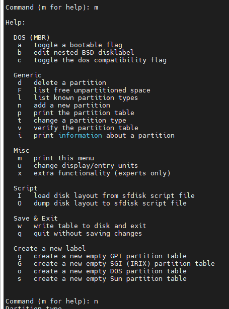

依次输入 **n，p，1**

这里1表示分1个磁盘区

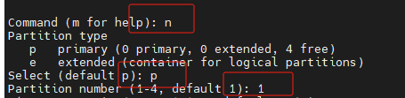

> 扩展：fdisk 语法
>
> fdisk [必要参数] [选择参数]
>
> **必要参数：**
>
> - -l 列出素所有分区表
> - -u 与"-l"搭配使用，显示分区数目
>
> **选择参数：**
>
> - -s<分区编号> 指定分区
> - -v 版本信息
>
> **菜单操作说明**
>
> - m ：显示菜单和帮助信息
>
> - a ：活动分区标记/引导分区，设置硬盘启动区
>
> - d ：删除分区
>
> - l ：显示分区类型
>
> - n ：新建分区
>
> - - p：硬盘为主要分区
>   - e：硬盘为延伸分区
>
> - p ：显示硬盘分区信息，打印分区表
>
> - q ：退出不保存
>
> - t ：设置分区号，设置硬盘分区属性
>
> - v ：进行分区检查
>
> - w ：保存修改
>
> - x ：扩展应用，高级功能

直接**按两次回车确认**

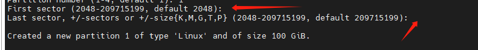

输入 **w** 保存

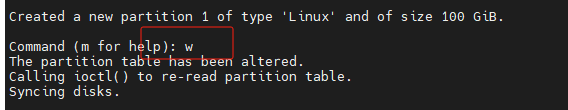

再次使用 **fdisk -l** 命令查看，发现 /dev/vdb 多了 /dev/vdb1 便是已经完成了分区工作，vdb1表示第一个分区

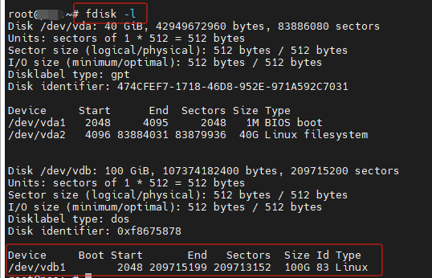

## 2.2 格式化

命令：

~~~shell
mkfs -t ext4 /dev/vdb1
~~~

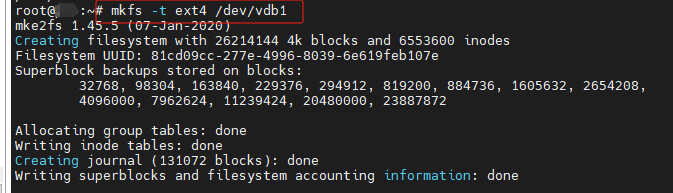

# 3 挂载磁盘

## 3.1 创建目录

命令：

~~~shell
mkdir /data
~~~

## 3.2 挂载磁盘

*这里我们 home 没有挂载，我们就直接挂到 home上，不挂到上面创建的 data 上了*

命令：

~~~shell
mount /dev/vdb1 /home
~~~

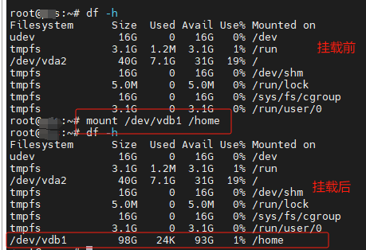

查看磁盘信息，确认挂载是否成功

命令：

~~~shell
df -h
~~~

如上图所示，挂载成功

# 4 设置开机启动自动挂载

## 4.1 获取磁盘分区uuid

命令：

~~~shell
blkid /dev/vdb1
~~~

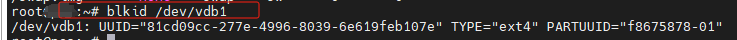

## 4.2 设置开机启动自动挂载

命令：

~~~shell
vi /etc/fstab
~~~

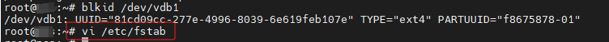

在最后一行按格式添加内容

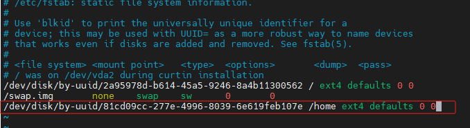

格式：

~~~
/dev/disk/by-uuid/81cd09cc-277e-4996-8039-6e619feb107e /home ext4 defaults 0 0

/dev/disk/by-uuid/81cd09cc-277e-4996-8039-6e619feb107e  分区设备文件名或uuid，也可以使用文件名 /dev/vdb1

/home 挂载点

ext4  文件系统名称

defaults	挂载参数

0	指定分区是否被dump备份,0不备份,1每天备份,2不定期备份

0	指定分区是否被fsck检测,0不检测,其它数字代表检测的优先级,1的优先级比2高
~~~

# 5 开启自启测试

命令：

~~~shell
init6 或 reboot
~~~

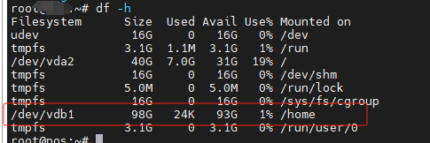

挂载成功。

---

CSDN：[https://blog.csdn.net/dkbnull/article/details/136158539](https://blog.csdn.net/dkbnull/article/details/136158539)

微信：[https://mp.weixin.qq.com/s/GeqJ4bp947ItPch18SMX9w](https://mp.weixin.qq.com/s/GeqJ4bp947ItPch18SMX9w)

---

