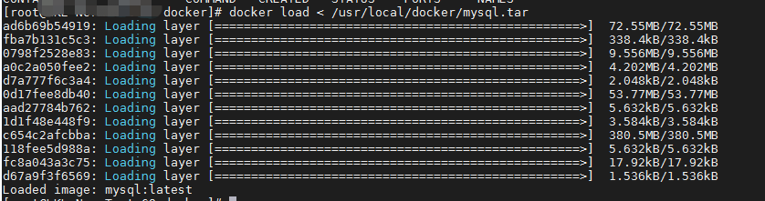
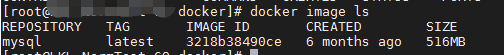
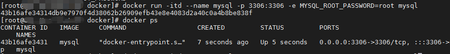

# 1 查看所有镜像

~~~shell
docker images
~~~

注：如果我们想打包本服务器没有的镜像，可以先将镜像拉下来，比如

~~~shell
docker pull openjdk:8
~~~

# 2 打包镜像到服务器指定目录

~~~shell
docker save mysql > /root/test/mysql.tar
~~~

mysql 是镜像名字

# 3 下载打包的mysql.tar文件，并上传到新服务器

# 4 加载镜像

~~~shell 
docker load < /usr/local/docker/mysql.tar
~~~

# 5 查看加载的镜像

~~~shell
docker image ls
#或
docker images 
~~~

# 6 创建容器

~~~shell
docker run -itd --name mysql -p 3306:3306 -e MYSQL_ROOT_PASSWORD=root mysql 
~~~

启动成功，docker ps也能查到，成功

---

CSDN：[https://blog.csdn.net/dkbnull/article/details/136159798](https://blog.csdn.net/dkbnull/article/details/136159798)

微信：[https://mp.weixin.qq.com/s/8WcogkO0hCcooLOquC1JuA](https://mp.weixin.qq.com/s/8WcogkO0hCcooLOquC1JuA)

---

