# 1 安装Docker Desktop

下载地址：[https://www.docker.com/products/docker-desktop/](https://www.docker.com/products/docker-desktop/)

安装成功后，可在cmd查看版本号

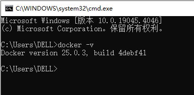

# 2 启动Docker Desktop

**启动成功后，Docker服务才能正常使用**

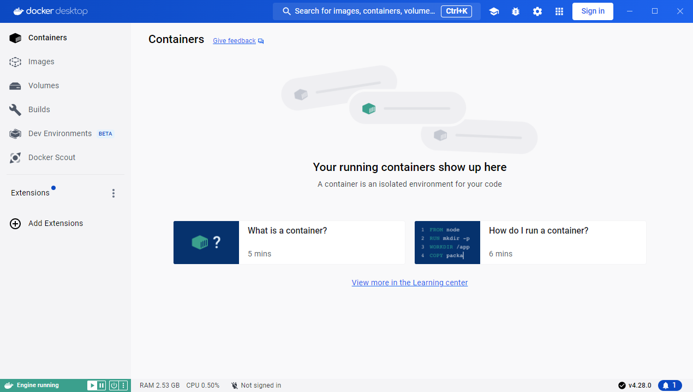

# 3 IDEA安装Docker插件

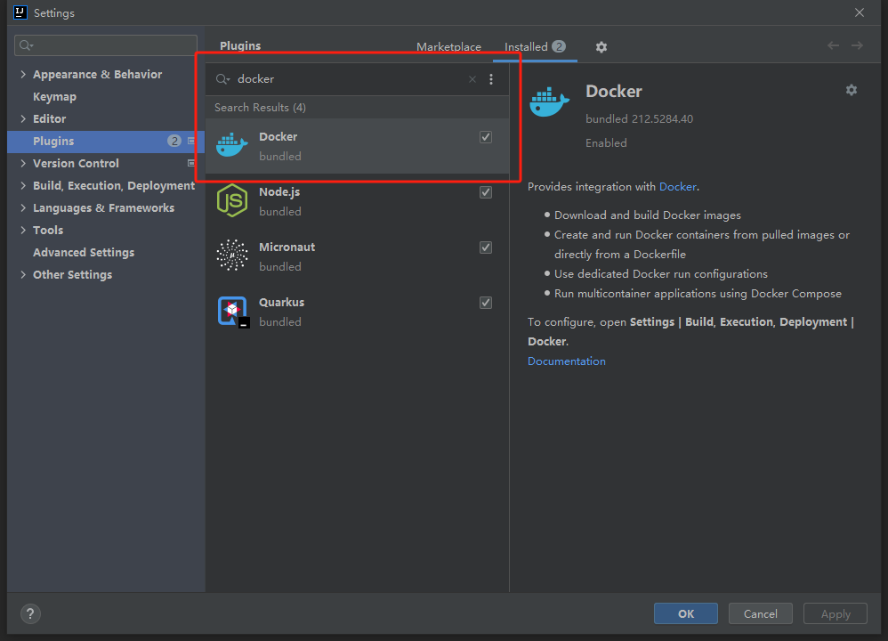

# 4 新建Dockerfile文件

**pom.xml同级目录下新建Dockerfile文件**

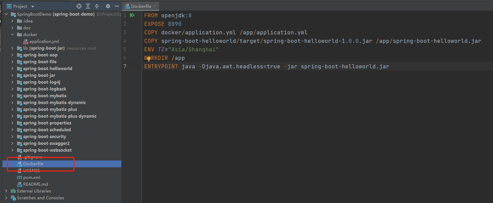

# 5 配置Docker服务

**Dockfile**文件上点击**绿色双箭头**，配置Docker服务

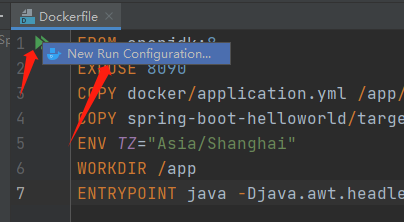

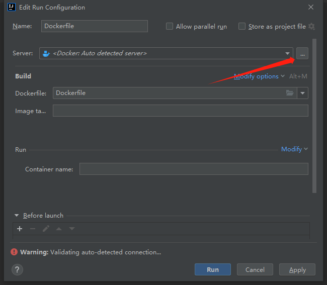

选择**Docker for Windows**后，下方出现**Connection successful**，表示连接本地Docker服务成功

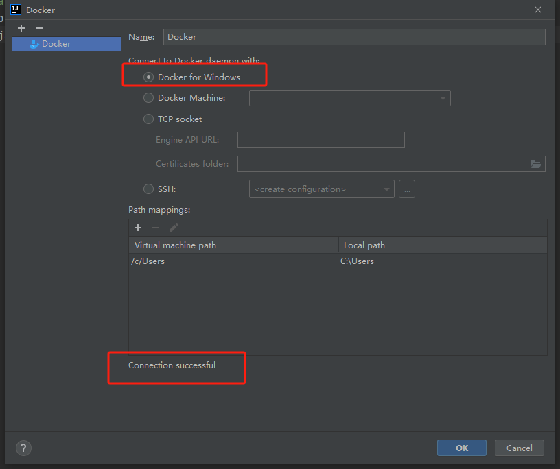

点击【OK】返回上一页，上一页中点击【Run】即可打包镜像并新建容器

# 6 打包镜像、新建容器

后续可直接点击Dockfile文件上绿色双箭头，打包镜像、新建容器

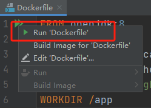

**注意：通过该方式打包的镜像，repository和tag可能为none**

**注意：如果想打包镜像并上传仓库，可以直接使用脚本，参考第10步**

如下图所示，镜像打包成功，容器创建成功

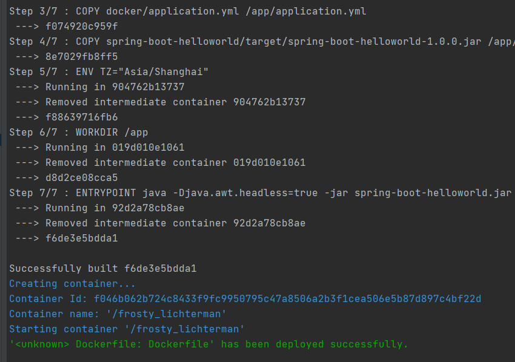

# 7 查看镜像和容器

在Docker Desktop可以查看打包或下载的镜像和容器

镜像：

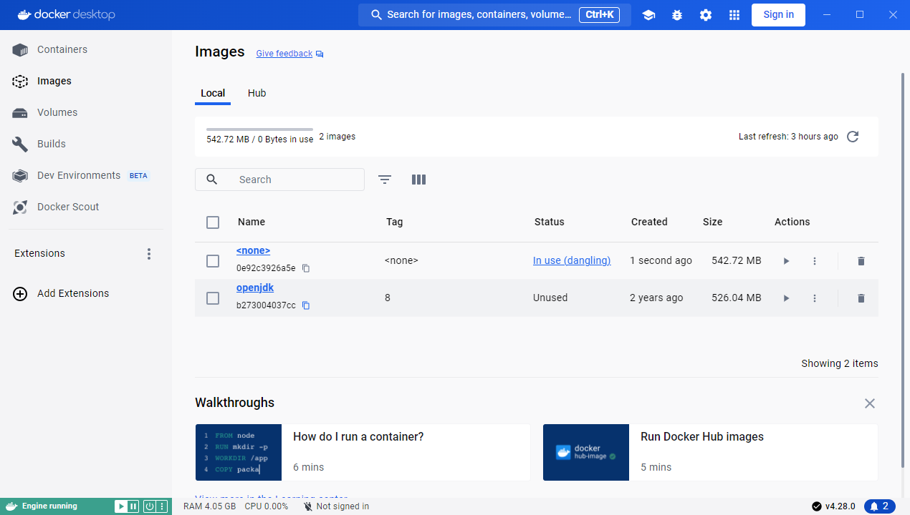

容器：

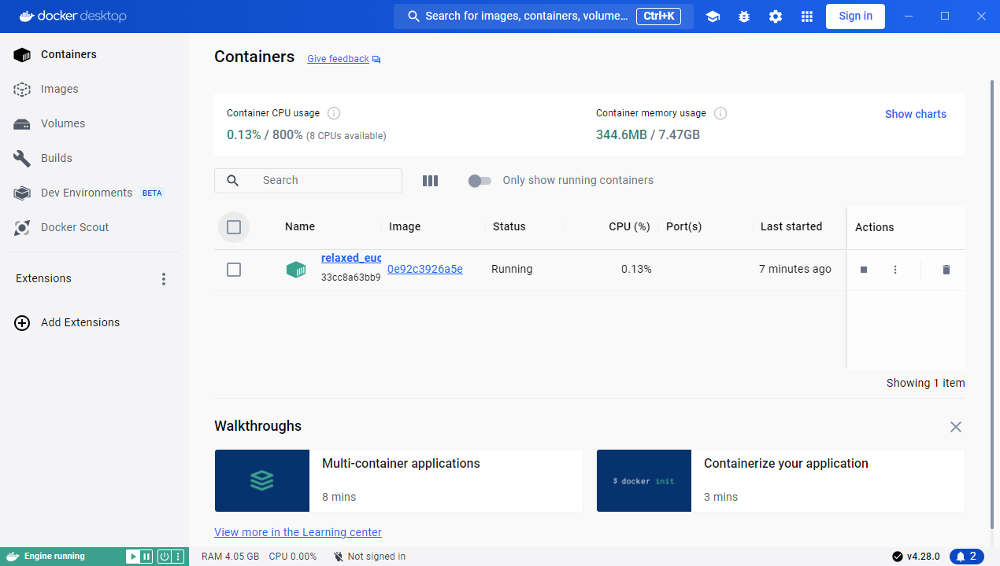

# 8 启动镜像，生成容器

可以直接在Docker Desktop上启动镜像，生成容器，支持配置**容器名、映射端口、数据卷、环境变量**

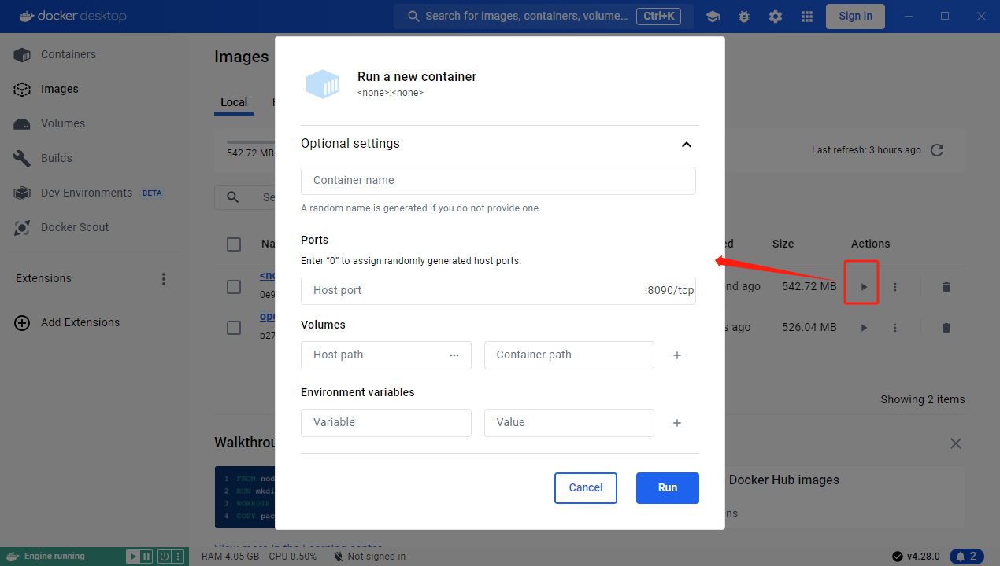

如下图所示，界面上有容器相关信息，支持启动、停止、重启、删除容器

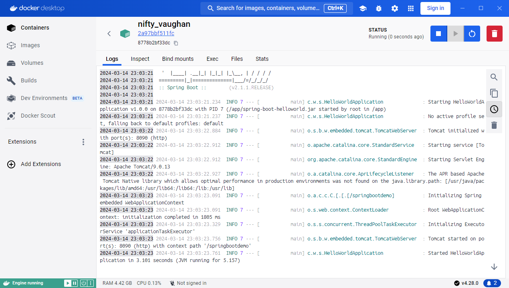

# 9 Docker命令查看

我们也可以直接在cmd中执行Docker相关命令查看

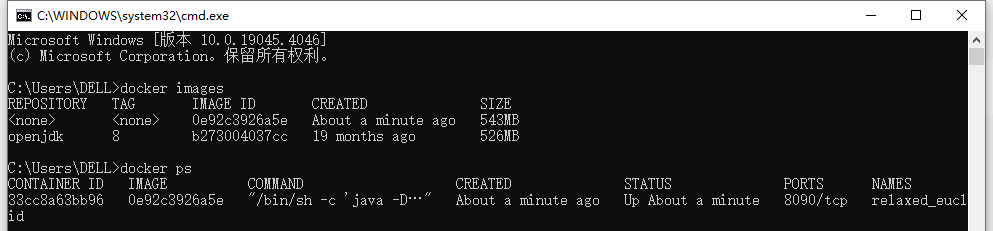

# 10 打包镜像并上传仓库

**如果我们想将本地服务打包镜像，并推到仓库，可以直接使用脚本**

## 10.1 修改daemon.json

修改 **C:\Users\用户名\\.docker** 目录下 **daemon.json**，配置上仓库地址

~~~json
{
	"builder": {
		"gc": {
			"defaultKeepStorage": "20GB",
			"enabled": true
		}
	},
	"experimental": false,
	
	"insecure-registries": [
		"devops.test.cn:5000"
	]
}
~~~

修改保存后，**重启Docker Desktop服务**

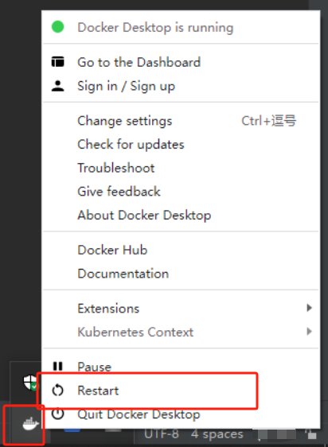

## 10.2 执行脚本

~~~bat
docker build -t devops.test.cn:5000/spring-boot-helloworld .
docker push devops.test.cn:5000/spring-boot-helloworld
~~~

打包并上传仓库成功

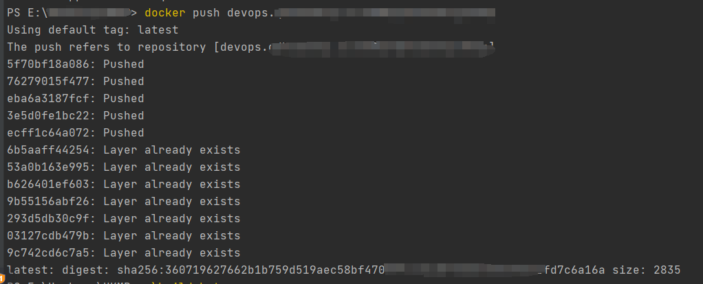

---

CSDN：[https://blog.csdn.net/dkbnull/article/details/136823918](https://blog.csdn.net/dkbnull/article/details/136823918)

微信：[https://mp.weixin.qq.com/s/AP34KiJ_cxM68kQ7a1nMqA](https://mp.weixin.qq.com/s/AP34KiJ_cxM68kQ7a1nMqA)

---

