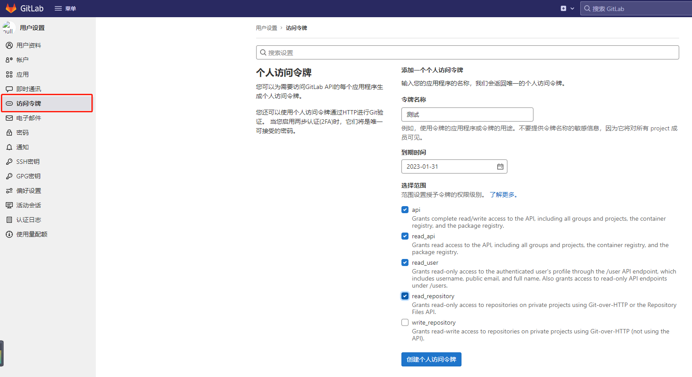
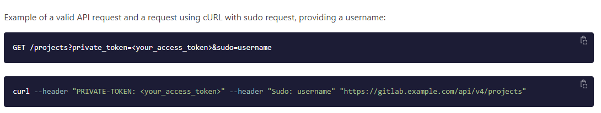
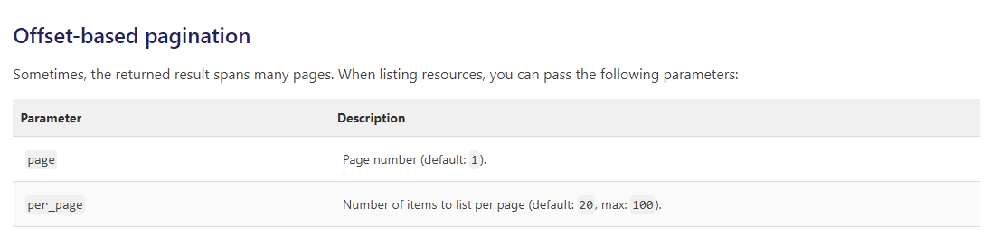

gitlab官方文档：[https://docs.gitlab.com/ee/api/index.html](https://docs.gitlab.com/ee/api/index.html)

## 1、生成密钥

登录gitlab，编辑个人资料，设置访问令牌

## 2、获取当前用户所有可见的项目

接口地址

~~~
GET请求
http://gitlab访问地址/api/v4/projects?private_token=xxx 
~~~

返回参数

~~~json
[
	{
		"id": 1,
		"description": "This project is automatically generated and helps monitor this GitLab instance. [Learn more](/help/administration/monitoring/gitlab_self_monitoring_project/index).",
		"name": "Monitoring",
		"name_with_namespace": "GitLab Instance / Monitoring",
		"path": "Monitoring",
		"path_with_namespace": "gitlab-instance-d71d8d97/Monitoring",
		"created_at": "2021-07-12T08:41:01.299Z",
		"default_branch": "main",
		"tag_list": [],
		"topics": [],
		"ssh_url_to_repo": "git@gitlab.example.cn:gitlab-instance-d71d8d97/Monitoring.git",
		"http_url_to_repo": "http://gitlab.example.cn/gitlab-instance-d71d8d97/Monitoring.git",
		"web_url": "http://gitlab.example.cn/gitlab-instance-d71d8d97/Monitoring",
		"readme_url": null,
		"avatar_url": null,
		"forks_count": 0,
		"star_count": 0,
		"last_activity_at": "2021-07-12T08:41:01.299Z",
		"namespace": {
			"id": 2,
			"name": "GitLab Instance",
			"path": "gitlab-instance-d71d8d97",
			"kind": "group",
			"full_path": "gitlab-instance-d71d8d97",
			"parent_id": null,
			"avatar_url": null,
			"web_url": "http://gitlab.example.cn/groups/gitlab-instance-d71d8d97"
		},
		"_links": {
			"self": "http://gitlab.example.cn/api/v4/projects/1",
			"issues": "http://gitlab.example.cn/api/v4/projects/1/issues",
			"merge_requests": "http://gitlab.example.cn/api/v4/projects/1/merge_requests",
			"repo_branches": "http://gitlab.example.cn/api/v4/projects/1/repository/branches",
			"labels": "http://gitlab.example.cn/api/v4/projects/1/labels",
			"events": "http://gitlab.example.cn/api/v4/projects/1/events",
			"members": "http://gitlab.example.cn/api/v4/projects/1/members"
		},
		"packages_enabled": true,
		
		...
		...
		...
	}
]
~~~

这里我们只需要关注项目id即可

## 3、获取当前项目所有分支

接口地址

~~~
GET请求
http://gitlab访问地址/api/v4/projects/项目id/repository/branches?private_token=xxx 
~~~

返回参数

~~~json
[
    {
        "name": "main",
        "commit": {
            "id": "2d3e01fbedf088fccb5000303428df35c09ea07d",
            "short_id": "2d3e01fb",
            "created_at": "2023-01-06T02:52:54.000+00:00",
            "parent_ids": null,
            "title": "xxxxxx",
            "message": "xxxxxx",
            "author_name": "xxxx",
            "author_email": "xxxx@example.cn",
            "authored_date": "2023-01-06T02:52:54.000+00:00",
            "committer_name": "xxxx",
            "committer_email": "xxxx@example.cn",
            "committed_date": "2023-01-06T02:52:54.000+00:00",
            "trailers": null,
            "web_url": "http://gitlab.example.cn/example/-/commit/2d3e01fbedf088fccb5000303428df35c09ea07d"
        },
        "merged": false,
        "protected": true,
        "developers_can_push": false,
        "developers_can_merge": false,
        "can_push": true,
        "default": true,
        "web_url": "http://gitlab.example.cn/example/-/tree/main"
    }
]
~~~

## 4、遍历分支，根据分支name获取commits

接口地址

~~~
GET请求
http://gitlab访问地址/api/v4/projects/项目id/repository/commits?ref_name=main&private_token=xxx 
~~~

返回参数

~~~json
[
	{
		"id": "8fc81980222370d51c11cd9bc609f10f3b7d9828",
		"short_id": "8fc81980",
		"created_at": "2022-07-21T08:46:35.000+00:00",
		"parent_ids": [],
		"title": "Initial commit",
		"message": "Initial commit",
		"author_name": "xxxx",
		"author_email": "xxxx@example.cn",
		"authored_date": "2022-07-21T08:46:35.000+00:00",
		"committer_name": "xxxx",
		"committer_email": "xxxx@example.cn",
		"committed_date": "2022-07-21T08:46:35.000+00:00",
		"trailers": {},
		"web_url": "http://gitlab.example.cn/example/-/commit/8fc81980222370d51c11cd9bc609f10f3b7d9828"
	}
]
~~~

## 5、根据commit的id获取代码量

接口地址

~~~
GET请求
http://gitlab访问地址/api/v4/projects/项目id/repository/commits/commit的id?private_token=xxx 
~~~

返回参数

~~~json
{
    "id": "8fc81980222370d51c11cd9bc609f10f3b7d9828",
    "short_id": "8fc81980",
    "created_at": "2022-07-21T08:46:35.000+00:00",
    "parent_ids": [],
    "title": "Initial commit",
    "message": "Initial commit",
    "author_name": "xxxx",
    "author_email": "xxxx@example.cn",
    "authored_date": "2022-07-21T08:46:35.000+00:00",
    "committer_name": "xxxx",
    "committer_email": "xxxx@example.cn",
    "committed_date": "2022-07-21T08:46:35.000+00:00",
    "trailers": {},
    "web_url": "http://gitlab.example.cn/example/-/commit/8fc81980222370d51c11cd9bc609f10f3b7d9828",
    "stats": {
        "additions": 92,
        "deletions": 0,
        "total": 92
    },
    "status": null,
    "project_id": 1,
    "last_pipeline": null
}
~~~

stats节点下参数就是我们本次提交的代码量，additions为新增行数，deletions为删除行数，total为总数。

修改操作实际上是删除之后再新增。

注：通过API获取gitlab项目、分支、commits时，默认只能查到20条数据，可以增加入参指定每页数量，数量最大为50000

Java代码实现

~~~java
private void gitLab() throws Exception {
    JSONObject params = new JSONObject();
    params.put("private_token", "xxx");
    params.put("per_page", "50000");

    //项目列表
    String result = WebUtils.doGet("http://gitlab.example.cn/api/v4/projects", params);
    JSONArray projects = JSONArray.parseArray(result);
    for (Object project : projects) {
        JSONObject projectValue = JSONObject.parseObject(project.toString());
        String projectId = projectValue.getString("id");

        //commits列表
        String url = String.format("http://gitlab.example.cn/api/v4/projects/%s/repository/commits", projectId);
        result = WebUtils.doGet(url, params);

        int additions = 0;
        int deletions = 0;
        int total = 0;

        JSONArray commits = JSONArray.parseArray(result);
        for (Object commit : commits) {
            JSONObject commitValue = JSONObject.parseObject(commit.toString());
            String commitId = commitValue.getString("id");

            url = String.format("http://gitlab.example.cn/api/v4/projects/%s/repository/commits/%s", projectId, commitId);

            //提交记录
            result = WebUtils.doGet(url, params);
            JSONObject commitStats = JSONObject.parseObject(result);
            JSONObject stats = commitStats.getJSONObject("stats");

            additions += stats.getIntValue("additions");
            deletions += stats.getIntValue("deletions");
            total += stats.getIntValue("total");
        }

        String name = projectValue.getString("name");
        LoggerUtils.info(String.format("项目：%s ，新增：%d ，删除：%d ，合计：%d", name, additions, deletions, total));
    }
}
~~~

以上是按照项目统计，扩展类似按作者统计是相同道理

---

CSDN：[https://blog.csdn.net/dkbnull/article/details/130457409](https://blog.csdn.net/dkbnull/article/details/130457409)

微信：[https://mp.weixin.qq.com/s/ZWwFWDdc7w7oBmCE5cfxmA](https://mp.weixin.qq.com/s/ZWwFWDdc7w7oBmCE5cfxmA)

---

