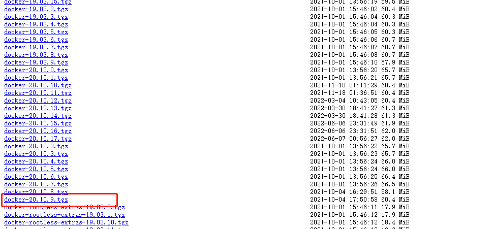
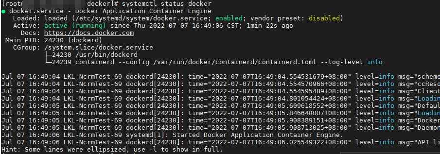
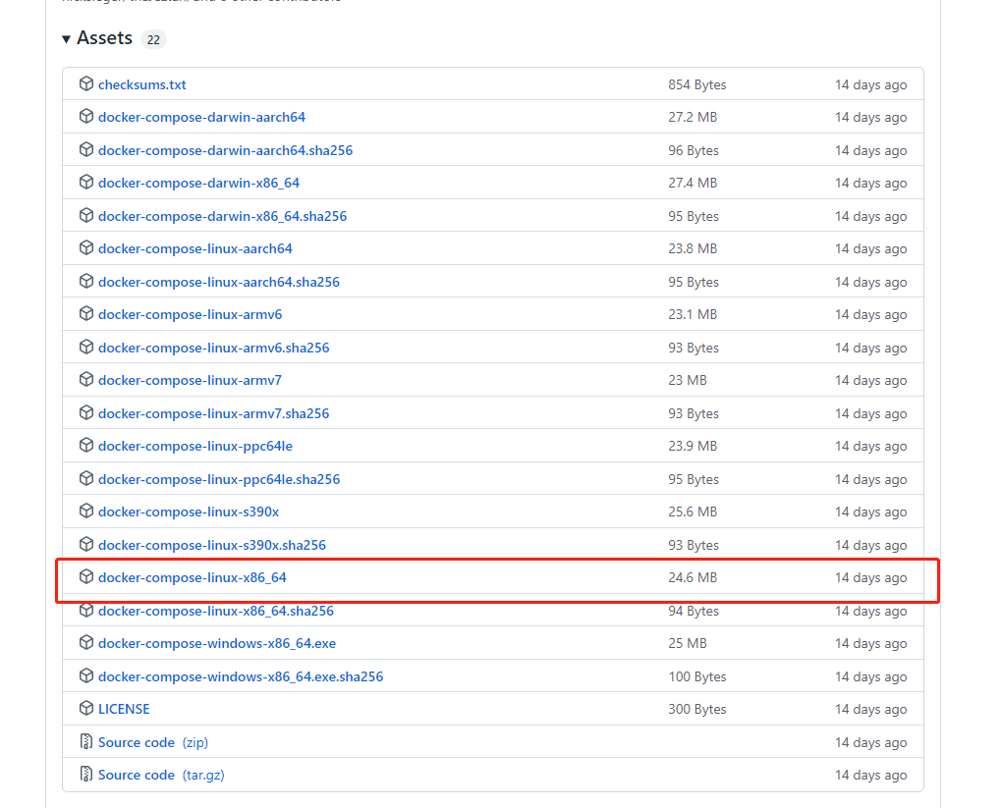
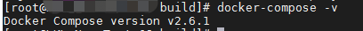

参考文档：[https://docs.docker.com/engine/install/binaries](https://docs.docker.com/engine/install/binaries/)

### 下载Docker安装包

下载地址：[https://download.docker.com/linux/static/stable/x86_64/](https://download.docker.com/linux/static/stable/x86_64/)

选择自己需要的版本下载，下载完成后上传到服务器

### 解压安装包

~~~shell
tar -zxvf docker-20.10.9.tgz
~~~

### 将docker相关命令拷贝到 /usr/bin

~~~shell
cp docker/* /usr/bin
~~~

### docker注册为系统服务

~~~shell
vim /etc/systemd/system/docker.service
~~~

~~~
[Unit]
Description=Docker Application Container Engine
Documentation=https://docs.docker.com
After=network-online.target firewalld.service
Wants=network-online.target
 
[Service]
Type=notify
ExecStart=/usr/bin/dockerd
ExecReload=/bin/kill -s HUP $MAINPID
LimitNOFILE=infinity
LimitNPROC=infinity
TimeoutStartSec=0
Delegate=yes
KillMode=process
Restart=on-failure
StartLimitBurst=3
StartLimitInterval=60s
 
[Install]
WantedBy=multi-user.target
~~~

### 添加执行权限

~~~shell
chmod +x /etc/systemd/system/docker.service
~~~

### 重新加载配置文件，每次修改docker.service时都需重新加载

~~~shell
systemctl daemon-reload
~~~

### 启动docker服务

~~~shell
systemctl start docker
~~~

### 设置开机自启

~~~shell
systemctl enable docker.service
~~~

### 查看docker状态

~~~shell
systemctl status docker
~~~

运行成功

如果需要再离线安装docker compose的话，继续往下

### 安装docker-compose

下载地址：<https://github.com/docker/compose/releases>

下载需要的版本即可，下载完成后重命名为**docker-compose**，上传到服务器 **/usr/local/bin**目录

### 添加可执行权限

~~~shell
sudo chmod +x /usr/local/bin/docker-compose
~~~

### 查看版本，测试是否安装成功

~~~shell
docker-compose -v
~~~

---

CSDN：[https://blog.csdn.net/dkbnull/article/details/130694730](https://blog.csdn.net/dkbnull/article/details/130694730)

微信：[https://mp.weixin.qq.com/s/rvJxaY_M3r5SlYsGd9wPWg](https://mp.weixin.qq.com/s/rvJxaY_M3r5SlYsGd9wPWg)

---