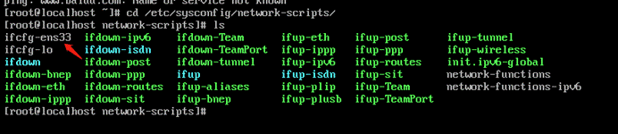
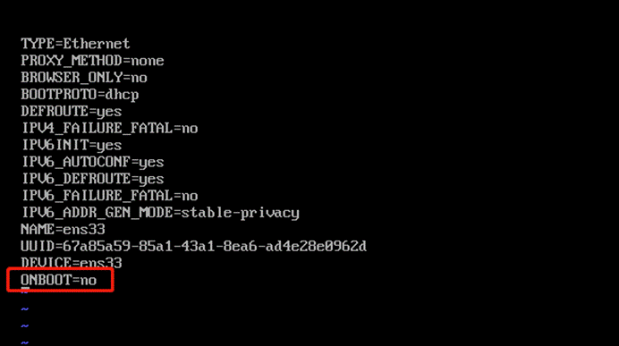
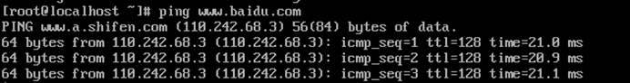

当使用虚拟机centos系统，ping百度时出现**Name or service not known**，可以考虑网关是否是开启的。

我们进入网卡目录，修改网卡配置

~~~shell
cd /etc/sysconfig/network-scripts/

ls
~~~

查看ifcfg-ens具体值是多少

 修改网卡配置

~~~shell
vi ifcfg-ens33
~~~

进入网卡配置后，查看ONBOOT值是yes还是no，no的话改为yes，然后保存退出，重启系统

 再ping百度，发现网络正常了。

 

---

CSDN：[https://blog.csdn.net/dkbnull/article/details/129033267](https://blog.csdn.net/dkbnull/article/details/129033267)

微信：[https://mp.weixin.qq.com/s/s7sVYFdLF1NBw2WZ5uz7JA](https://mp.weixin.qq.com/s/s7sVYFdLF1NBw2WZ5uz7JA)

---