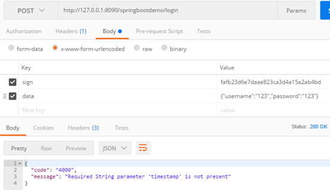
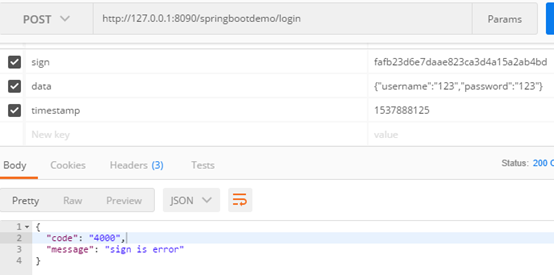
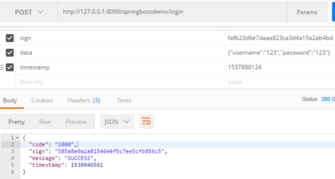

当我们使用Spring Boot发布后台接口时，如果多个接口存在相同的操作，比如对参数进行非空校验或验签。这些操作都是在具体业务代码之前，如果我们每个接口都进行独立编码，即使我们将验签操作封装成方法，也会有大量重复代码。这时我们可以使用AOP实现拦截器，对参数进行非空校验或验签。

# 引包

首先引包。

~~~xml
<dependency>
   <groupId>org.aspectj</groupId>
   <artifactId>aspectjweaver</artifactId>
   <version>1.9.1</version>
</dependency>
~~~

aspectjweaver用于引入AOP的相关的注解，如@Aspect、@Pointcut

# 自定义异常类

新建GlobalException异常类，用于捕捉全局异常。

~~~java
public class GlobalException extends Exception {

    private static final long serialVersionUID = -238091758285157331L;

    private String code;
    private String message;

    public GlobalException() {
        super();
    }

    public GlobalException(String message) {
        super(message);
        this.message = message;
    }

    public GlobalException(String code, String message) {
        super(code + ": " + message);
        this.code = code;
        this.message = message;
    }

    public GlobalException(String message, Throwable throwable) {
        super(message, throwable);
        this.message = message;
    }

    public GlobalException(Throwable throwable) {
        super(throwable);
    }

    public String getCode() {
        return code;
    }

    @Override
    public String getMessage() {
        return message;
    }

    @Override
    public String toString() {
        return code + ": " + message;
    }
}
~~~

# 全局异常处理器

新建全局异常处理器，用户处理捕捉到的异常。

~~~java
import com.alibaba.fastjson.JSONObject;
import org.springframework.web.bind.annotation.ExceptionHandler;
import org.springframework.web.bind.annotation.ResponseBody;
import org.springframework.web.bind.annotation.RestControllerAdvice;

import javax.servlet.http.HttpServletRequest;

@RestControllerAdvice
public class GlobalExceptionHandler {

    @ExceptionHandler(value = Exception.class)
    @ResponseBody
    public JSONObject exceptionHandler(HttpServletRequest request, Exception e) {
        return ReturnMessage.createReturnMessage("4000", e.getMessage());
    }
}
~~~

# 自定义AOP

自定义AOP，对接口入参进行非空校验和验签；并对接口返回参数进行签名。

~~~java
import cn.wbnull.springbootdemo.boot.GlobalException;
import cn.wbnull.springbootdemo.constant.DemoConstants;
import cn.wbnull.springbootdemo.util.JSONUtils;
import cn.wbnull.springbootdemo.util.StringUtils;
import com.alibaba.fastjson.JSONObject;
import org.apache.commons.codec.digest.DigestUtils;
import org.aspectj.lang.JoinPoint;
import org.aspectj.lang.annotation.AfterReturning;
import org.aspectj.lang.annotation.Aspect;
import org.aspectj.lang.annotation.Before;
import org.aspectj.lang.annotation.Pointcut;
import org.springframework.stereotype.Component;

@Aspect
@Component
public class SignAop {

    /**
     * 声明一个切入点，范围为controller包下所有的类
     * 注：作为切入点签名的方法必须返回void类型
     */
    @Pointcut("execution(public * cn.wbnull.springbootdemo.controller.*.*(..))")
    private void signAop() {

    }

    /**
     * 前置通知：在某连接点之前执行的通知，但这个通知不能阻止连接点之前的执行流程（除非它抛出一个异常）
     *
     * @param joinPoint
     * @throws Exception
     */
    @Before("signAop()")
    public void doBefore(JoinPoint joinPoint) throws Exception {
        Object[] objects = joinPoint.getArgs();
        String sign = objects[0].toString();
        String timestamp = objects[1].toString();
        String data = objects[2].toString();

        if (StringUtils.isEmpty(sign) || StringUtils.isEmpty(timestamp) ||
                StringUtils.isEmpty(data)) {
            throw new GlobalException("sign or timestamp or data is null");
        }

        String md5String = "data=" + data + "&key=1234567890&timestamp=" + timestamp;
        String signNow = DigestUtils.md5Hex(md5String);

        if (!sign.equalsIgnoreCase(signNow)) {
            throw new GlobalException("sign is error");
        }
    }

    /**
     * 后置通知：在某连接点正常完成后执行的通知，通常在一个匹配的方法返回的时候执行
     *
     * @param joinPoint
     * @param params
     * @return
     */
    @AfterReturning(value = "signAop()", returning = "params")
    public JSONObject doAfterReturning(JoinPoint joinPoint, JSONObject params) {
        String data = JSONUtils.getJSONString(params, DemoConstants.DATA);
        long timestamp = System.currentTimeMillis() / 1000;

        String md5String = "data=" + data + "&key=1234567890&timestamp=" + timestamp;
        String sign = DigestUtils.md5Hex(md5String);

        params.put(DemoConstants.TIMESTAMP, timestamp);
        params.put(DemoConstants.SIGN, sign);

        return params;
    }
}
~~~

# 控制器

新建登录接口控制器LoginController

~~~java
import com.alibaba.fastjson.JSONObject;
import org.springframework.context.annotation.Scope;
import org.springframework.web.bind.annotation.PostMapping;
import org.springframework.web.bind.annotation.RequestParam;
import org.springframework.web.bind.annotation.RestController;

@RestController
@Scope("prototype")
public class LoginController extends BaseController {

    @PostMapping(value = "/login")
    public JSONObject login(
            @RequestParam(value = "sign") String sign,
            @RequestParam(value = "timestamp") String timestamp,
            @RequestParam(value = "data") String data
    ) throws Exception {
        return baseService.login(data);
    }
}
~~~

# 服务类

新建登录接口服务类LoginService

```java
import cn.wbnull.springbootdemo.util.JSONUtils;
import cn.wbnull.springbootdemo.util.LoggerUtils;
import com.alibaba.fastjson.JSONObject;
import org.springframework.stereotype.Service;

@Service
public class LoginService {

    public JSONObject login(Object data) throws Exception {
        JSONObject responseParams = new JSONObject();

        JSONObject requestParams = JSONObject.parseObject(data.toString());
        if (JSONUtils.getJSONString(requestParams, "username").equalsIgnoreCase(
                JSONUtils.getJSONString(requestParams, "password"))) {
            responseParams.put("code", "1000");
            responseParams.put("message", "SUCCESS");
        } else {
            responseParams.put("code", "2000");
            responseParams.put("message", "FAIL");
        }

        return responseParams;
    }
}
```

# 测试

当传入参数缺少时，接口自动提示（未进入AOP）：

                         

当传入参数正常，但存在某参数为空时，AOP校验参数是否为空：

   

当传入参数正常且都不为空时，AOP执行@Before注释的方法进行验签操作：

   

若签名校验通过，则执行具体业务代码，并在接口返回时进入到@AfterReturning注释的方法进行签名返回：



# 日志记录

增加日志记录，更方便直观的查看代码执行顺序。

1、引包

```xml
<dependency>
   <groupId>log4j</groupId>
   <artifactId>log4j</artifactId>
   <version>1.2.17</version>
</dependency>
```

2、配置日志记录格式log4j.properties

```properties
log4j.rootLogger=debug,Console,logInfo,logError,logDebug
log4j.category.org.springframework=debug,Console,logInfo,logError,logDebug
#输出到控制台
log4j.appender.Console=org.apache.log4j.ConsoleAppender
log4j.appender.Console.Target=System.out
log4j.appender.Console.layout=org.apache.log4j.PatternLayout
log4j.appender.Console.layout.ConversionPattern=[%p][%d{yyyy-MM-dd HH\:mm\:ss,SSS}][%C.%M(%F\:%L)] || %m%n
#输出到文件
log4j.appender.logInfo=org.apache.log4j.DailyRollingFileAppender
log4j.appender.logInfo.File=${pwd}/SpringBootDemoLogs/SpringBootDemoLog_
log4j.appender.logInfo.Append=true
log4j.appender.logInfo.DatePattern=yyyy-MM-dd'.log'
log4j.appender.logInfo.Threshold=ALL
log4j.appender.logInfo.layout=org.apache.log4j.PatternLayout
log4j.appender.logInfo.layout.ConversionPattern=[%p][%d{yyyy-MM-dd HH\:mm\:ss,SSS}][%C.%M(%F\:%L)] || %m%n
#错误日志单独记录
log4j.appender.logError=org.apache.log4j.DailyRollingFileAppender
log4j.appender.logError.File=${pwd}/SpringBootDemoLogs/SpringBootDemoErrorLog_
log4j.appender.logError.Append=true
log4j.appender.logError.DatePattern=yyyy-MM-dd'.log'
log4j.appender.logError.Threshold=ERROR
log4j.appender.logError.layout=org.apache.log4j.PatternLayout
log4j.appender.logError.layout.ConversionPattern=[%p][%d{yyyy-MM-dd HH\:mm\:ss,SSS}][%C.%M(%F\:%L)] || %m%n
#Debug日志单独记录
log4j.appender.logDebug=org.apache.log4j.DailyRollingFileAppender
log4j.appender.logDebug.File=${pwd}/SpringBootDemoLogs/SpringBootDemoDebugLog_
log4j.appender.logDebug.Append=true
log4j.appender.logDebug.DatePattern=yyyy-MM-dd'.log'
log4j.appender.logDebug.Threshold=DEBUG
log4j.appender.logDebug.layout=org.apache.log4j.PatternLayout
log4j.appender.logDebug.filter.infoFilter=org.apache.log4j.varia.LevelRangeFilter
log4j.appender.logDebug.filter.infoFilter.LevelMin=DEBUG
log4j.appender.logDebug.filter.infoFilter.LevelMax=DEBUG
log4j.appender.logDebug.layout.ConversionPattern=[%p][%d{yyyy-MM-dd HH\:mm\:ss,SSS}][%C.%M(%F\:%L)] || %m%n
```

3、Logger工具类LoggerUtils

```java
import org.apache.log4j.Logger;

public class LoggerUtils {

    private static Logger logger;

    public static Logger getLogger() {
        if (logger == null) {
            logger = Logger.getLogger("SpringBootDemoLogs");
        }
        return logger;
    }
}
```

4、SignAop增加日志记录

```java
@Before("signAop()")
public void doBefore(JoinPoint joinPoint) throws Exception {
    //code

    String strLog = "[" + Thread.currentThread().getId() + "]" + "[请求方法] " + joinPoint.getSignature().getName() + " ||";
    LoggerUtils.getLogger().info(strLog + "[请求参数] sign=" + sign + ",timestamp=" + timestamp + ",data=" + data);

    //code

}

@AfterReturning(value = "signAop()", returning = "params")
public JSONObject doAfterReturning(JoinPoint joinPoint, JSONObject params) {
    //code

    String strLog = "[" + Thread.currentThread().getId() + "]" + "[请求方法] " + joinPoint.getSignature().getName() + " ||";
    LoggerUtils.getLogger().info(strLog + "[返回参数] " + params);

    return params;
}
```

5、Postman请求，日志记录如下

~~~
[INFO][2018-09-25 23:59:46,483][cn.wbnull.springbootdemo.boot.aop.SignAop.doBefore(SignAop.java:50)] || [21][请求方法] login ||[请求参数] sign=fafb23d6e7daae823ca3d4a15a2ab4bd,timestamp=1537888124,data={"username":"123","password":"123"}
[INFO][2018-09-25 23:59:46,499][cn.wbnull.springbootdemo.controller.LoginController.login(LoginController.java:26)] || [21] LoginController
[INFO][2018-09-25 23:59:46,604][cn.wbnull.springbootdemo.service.LoginService.login(LoginService.java:30)] || [21] LoginService
[INFO][2018-09-25 23:59:46,615][cn.wbnull.springbootdemo.boot.aop.SignAop.doAfterReturning(SignAop.java:84)] || [21][请求方法] login ||[返回参数] {"code":"1000","sign":"18954bd1a668e0d6fc98e4e15386352f","message":"SUCCESS","timestamp":1537891186}
~~~


---

GitHub：[https://github.com/dkbnull/SpringBootDemo](https://github.com/dkbnull/SpringBootDemo)

Gitee：[https://gitee.com/dkbnull/SpringBootDemo](https://gitee.com/dkbnull/SpringBootDemo)

CSDN：[https://blog.csdn.net/dkbnull/article/details/82847647](https://blog.csdn.net/dkbnull/article/details/82847647)

微信：[https://mp.weixin.qq.com/s/COFnrvWOcZPM7Ec-0bv98Q](https://mp.weixin.qq.com/s/COFnrvWOcZPM7Ec-0bv98Q)

微博：[https://weibo.com/ttarticle/p/show?id=2309404288955024574905](https://weibo.com/ttarticle/p/show?id=2309404288955024574905)

 知乎：[https://zhuanlan.zhihu.com/p/95083475](https://zhuanlan.zhihu.com/p/95083475)

---

