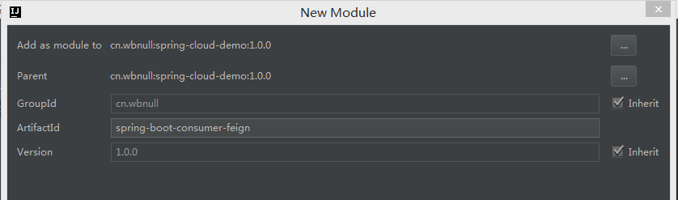
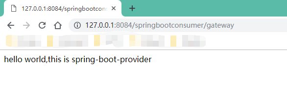
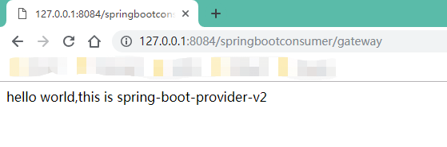
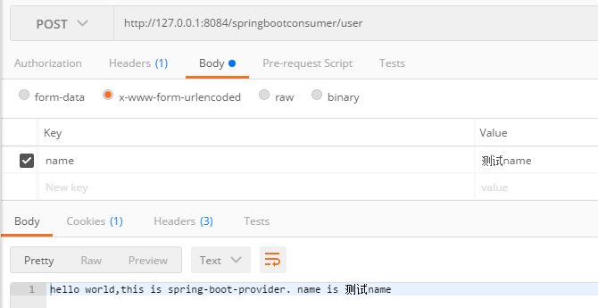
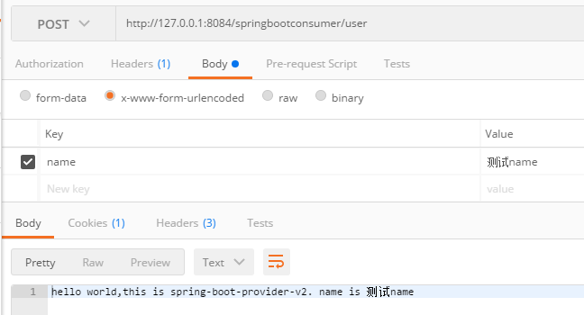
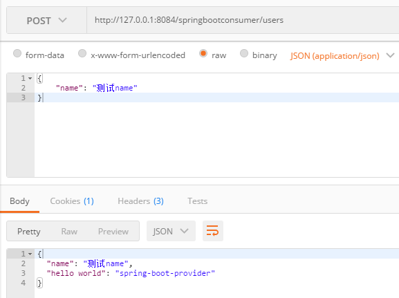
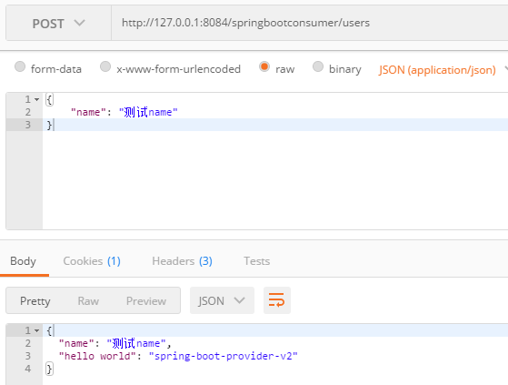

在上一篇文章 [Spring Cloud 自定义Eureka Ribbon负载均衡策略](https://blog.csdn.net/dkbnull/article/details/89506462) 中，我们使用Ribbon自定义的策略实现了负载均衡，接下来我们介绍下Spring Cloud的另一种服务调用方式**Feign**。

# 0. 开发环境

- IDE：IntelliJ IDEA 2017.1 x64

- jdk：1.8.0_91

- Spring Boot：2.0.9.RELEASE

- Spring Cloud：Finchley.RELEASE


# 1. Feign简介

Feign是一个声明式的伪Http Web服务客户端，它使得写Http客户端变得非常简单。使用Feign，只需创建一个接口并注解，就可实现服务间调用。它具有可插拔的注解特性，支持使用Feign注解、JAX-RS注解、Spring MVC注解。Feign默认集成了Ribbon，并结合了Eureka，默认实现了负载均衡。

# 2. 新建Feign服务消费者

## 2.1 新建Feign服务消费者



## 2.2 引入依赖

~~~xml
<?xml version="1.0" encoding="UTF-8"?>
<project xmlns="http://maven.apache.org/POM/4.0.0"
         xmlns:xsi="http://www.w3.org/2001/XMLSchema-instance"
         xsi:schemaLocation="http://maven.apache.org/POM/4.0.0 http://maven.apache.org/xsd/maven-4.0.0.xsd">
    <modelVersion>4.0.0</modelVersion>
    
    <artifactId>spring-boot-consumer-feign</artifactId>
    <packaging>jar</packaging>

    <parent>
        <artifactId>spring-cloud-demo</artifactId>
        <groupId>cn.wbnull</groupId>
        <version>1.0.0</version>
    </parent>

    <dependencies>
        <dependency>
            <groupId>org.springframework.boot</groupId>
            <artifactId>spring-boot-starter-web</artifactId>
        </dependency>
        <dependency>
            <groupId>org.springframework.cloud</groupId>
            <artifactId>spring-cloud-starter-netflix-eureka-client</artifactId>
        </dependency>
        <dependency>
            <groupId>org.springframework.cloud</groupId>
            <artifactId>spring-cloud-starter-openfeign</artifactId>
        </dependency>
    </dependencies>
</project>
~~~

## 2.3 新建application.yml

~~~yml
server:
  port: 8084
  servlet:
    context-path: /springbootconsumer

spring:
  application:
    name: spring-boot-consumer-feign

eureka:
  client:
    register-with-eureka: false
    fetch-registry: true
    service-url:
      defaultZone: http://localhost:8090/springcloudeureka/eureka/
~~~

## 2.4 新建Spring Boot启动类

这里要注意，启动类需增加类注解**@EnableFeignClients**，表示此项目为Feign客户端

~~~java
package cn.wbnull.springbootconsumer;

import org.springframework.boot.SpringApplication;
import org.springframework.boot.autoconfigure.SpringBootApplication;
import org.springframework.cloud.netflix.eureka.EnableEurekaClient;
import org.springframework.cloud.openfeign.EnableFeignClients;

@SpringBootApplication
@EnableEurekaClient
@EnableFeignClients
public class SpringBootConsumerFeignApplication {

    public static void main(String[] args) {
        SpringApplication.run(SpringBootConsumerFeignApplication.class, args);
    }
}
~~~

## 2.5 定义Feign接口

cn.wbnull.springbootconsumer包下新建feign包，再新建**GatewayFeignClient接口类**。

* @FeignClient("服务id名称")，表示调用哪个服务
* @GetMapping(value = "接口地址")，表示调用哪个接口。这里要注意<font color="#FF0000">**接口地址要保留server.servlet.context-path部分，没有则省略**</font>

~~~java
package cn.wbnull.springbootconsumer.feign;

import org.springframework.cloud.openfeign.FeignClient;
import org.springframework.web.bind.annotation.GetMapping;

@FeignClient("spring-boot-provider")
public interface GatewayFeignClient {

    @GetMapping(value = "/springbootprovider/gateway")
    String gateway() throws Exception;
}
~~~

## 2.6 新建控制器类

cn.wbnull.springbootconsumer包下新建controller包，再新建**GatewayController类**。

~~~java
package cn.wbnull.springbootconsumer.controller;

import cn.wbnull.springbootconsumer.feign.GatewayFeignClient;
import org.springframework.beans.factory.annotation.Autowired;
import org.springframework.context.annotation.Scope;
import org.springframework.web.bind.annotation.GetMapping;
import org.springframework.web.bind.annotation.RestController;

@RestController
@Scope("prototype")
public class GatewayController {

    @Autowired
    private GatewayFeignClient gatewayFeignClient;

    @GetMapping(value = "/gateway")
    public String gateway() throws Exception {
        return gatewayFeignClient.gateway();
    }
}
~~~

这里@Autowired GatewayFeignClient可能会有报错，是因为这个Bean是程序启动时注入的，现在编译器还无法装配，可以不用管，启动程序不会报错。但是如果看着报错不顺眼非要去掉，可以在刚才的GatewayFeignClient接口类增加@Component注解。

## 2.7 测试

依次启动spring-cloud-eureka，spring-boot-provider，spring-boot-provider-v2，spring-boot-consumer-feign。然后浏览器访问http://127.0.0.1:8084/springbootconsumer/gateway，不断刷新，可以到到返回信息正常，且 *hello world,this is spring-boot-provider* 和 *hello world,this is spring-boot-provider-v2* 交替出现。





## 2.8 增加传参接口

刚才我们服务消费者调用服务提供者的接口，都是没有参数的，下面我们新建一个带参数的接口进行测试。

### 2.8.1 修改spring-boot-provider

spring-boot-provider服务GatewayController类增加如下代码

~~~java
    @PostMapping(value = "/user")
    public String user(@RequestParam(value = "name") String name) throws Exception {
        return "hello world,this is spring-boot-provider. name is " + name;
    }
~~~

### 2.8.2 修改spring-boot-provider-v2

spring-boot-provider-v2服务GatewayController类增加如下代码

~~~java
    @PostMapping(value = "/user")
    public String user(@RequestParam(value = "name") String name) throws Exception {
        return "hello world,this is spring-boot-provider-v2. name is " + name;
    }
~~~

### 2.8.3修改spring-boot-consumer-feign

1、spring-boot-consumer-feign服务GatewayFeignClient类增加如下代码

~~~java
    @PostMapping(value = "/springbootprovider/user")
    String user(@RequestParam(value = "name") String name) throws Exception;
~~~

2、spring-boot-consumer-feign服务GatewayController类增加如下代码

~~~java
    @PostMapping(value = "/user")
    public String user(@RequestParam(value = "name") String name) throws Exception {
        return gatewayFeignClient.user(name);
    }
~~~

### 2.8.4 测试

依次启动spring-cloud-eureka，spring-boot-provider，spring-boot-provider-v2，spring-boot-consumer-feign。然后打开Postman，配置如下，不断点击Send按钮，可以看到返回信息正常，且 *hello world,this is spring-boot-provider. name is 测试name* 和 *hello world,this is spring-boot-provider-v2. name is 测试name* 交替出现。





# 3. 自定义Feign配置

上篇我们自定义Ribbon负载均衡策略时，会出现包扫描的问题，Feign自定义配置也同样存在这个问题，这里我们不再赘述，直接使用注解 **@ComponentScan** 自定义扫描类。但是与上篇不同，我们这里自定义一个注解，当Java类使用了该注解时，@ComponentScan就会忽略扫描。

cn.wbnull.springbootconsumer包下新建config包，再新建ComponentScanExclude注解类

~~~java
package cn.wbnull.springbootconsumer.config;

public @interface ComponentScanExclude {
}
~~~

## 3.1 自定义配置类

config包下新建GlobalConfiguration类

~~~java
package cn.wbnull.springbootconsumer.config;

import feign.Contract;
import org.springframework.context.annotation.Bean;
import org.springframework.context.annotation.Configuration;

@Configuration
@ComponentScanExclude
public class GlobalConfiguration {

    @Bean
    public Contract GlobalContract() {
        return new Contract.Default();
    }
}
~~~

### 3.1.1 Contract

我们可以看到 GlobalConfiguration 类的 GlobalContract() 方法返回了一个 Contract 对象，Contract 表示契约，说白了，就是一个注解解释器。前面我们说过，Feign支持使用Feign注解、JAX-RS注解、Spring MVC注解。Contract 可以帮助我们将这些注解解释成Feign能够理解的Http请求。我们也可以通过自定义一个Contract 解释器来实现我们自己的注解，这个放到后面介绍，本篇不做赘述。

Feign一开始默认使用的契约是Spring MVC，所以我们前面测试使用的都是Spring MVC注解。但现在我们return new Contract.Default()，Contract.Default()默认使用的契约是Feign，所以我们也对应的要修改成Feign注解。

## 3.2 加载自定义配置

修改GatewayFeignClient类，@FeignClient 注解引入自定义配置类，并且将接口注解修改成Feign注解

~~~java
package cn.wbnull.springbootconsumer.feign;

import cn.wbnull.springbootconsumer.config.GlobalConfiguration;
import feign.Param;
import feign.RequestLine;
import org.springframework.cloud.openfeign.FeignClient;
import org.springframework.stereotype.Component;

@Component
@FeignClient(value = "spring-boot-provider", configuration = GlobalConfiguration.class)
public interface GatewayFeignClient {

    @RequestLine("GET /springbootprovider/gateway")
    String gateway() throws Exception;

    @RequestLine("POST /springbootprovider/user?name={name}")
    String user(@Param("name") String name) throws Exception;
}
~~~

## 3.3 测试

依次启动spring-cloud-eureka，spring-boot-provider，spring-boot-provider-v2，spring-boot-consumer-feign。然后浏览器访问http://127.0.0.1:8084/springbootconsumer/gateway，不断刷新，跟刚才测试结果相同；Postman配置跟刚才一样，不断点击Send，跟刚才测试结果相同。

## 3.4 增加application/json方式传参接口

下面我们再新建一个application/json方式传参的接口进行测试。

### 3.4.1 修改spring-boot-provider

spring-boot-provider服务GatewayController类增加如下代码

~~~java
    @PostMapping(value = "/users")
    public Map<String, String> users(@RequestBody Map<String, String> request) throws Exception {
        request.put("hello world", "spring-boot-provider");

        return request;
    }
~~~

### 3.4.2 修改spring-boot-provider-v2

spring-boot-provider-v2服务GatewayController类增加如下代码

```java
    @PostMapping(value = "/users")
    public Map<String, String> users(@RequestBody Map<String, String> request) throws Exception {
        request.put("hello world", "spring-boot-provider-v2");

        return request;
    }
```

### 3.4.3修改spring-boot-consumer-feign

1、spring-boot-consumer-feign服务GatewayFeignClient类增加如下代码

```java
    @RequestLine("POST /springbootprovider/users")
    @Headers("Content-Type: application/json")
    Map<String, String> users(Map<String, String> request) throws Exception;
```

2、spring-boot-consumer-feign服务GatewayController类增加如下代码

```java
    @PostMapping(value = "/users")
    public Map<String, String> users(@RequestBody Map<String, String> request) throws Exception {
        return gatewayFeignClient.users(request);
    }
```

### 2.8.4 测试

依次启动spring-cloud-eureka，spring-boot-provider，spring-boot-provider-v2，spring-boot-consumer-feign。然后打开Postman，配置如下，不断点击Send按钮，可以看到返回信息正常，且两组返回信息交替出现。






---

GitHub：[https://github.com/dkbnull/SpringCloudDemo](https://github.com/dkbnull/SpringCloudDemo)

Gitee：[https://gitee.com/dkbnull/SpringCloudDemo](https://gitee.com/dkbnull/SpringCloudDemo)

CSDN：[https://blog.csdn.net/dkbnull/article/details/89525792](https://blog.csdn.net/dkbnull/article/details/89525792)

微信：[https://mp.weixin.qq.com/s/RL8ZtwH3x6XZLzE-pYj6dA](https://mp.weixin.qq.com/s/RL8ZtwH3x6XZLzE-pYj6dA)

微博：[https://weibo.com/ttarticle/p/show?id=2309404369596210654515](https://weibo.com/ttarticle/p/show?id=2309404369596210654515)

知乎：[https://zhuanlan.zhihu.com/p/65008318](https://zhuanlan.zhihu.com/p/65008318)

---


