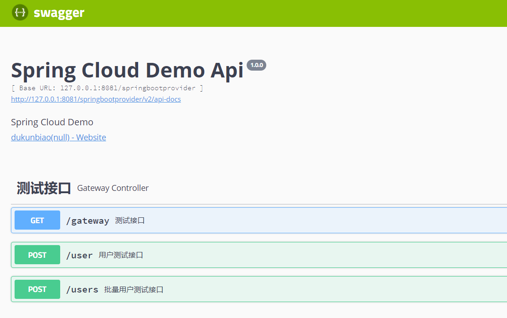
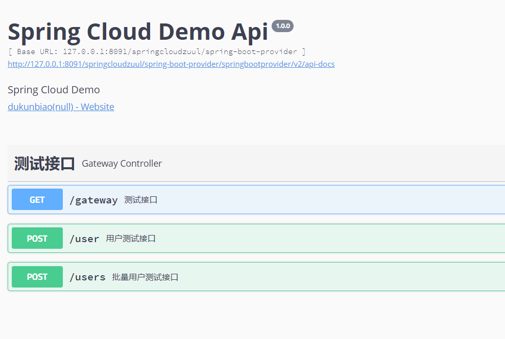

**Spring Boot整合Swagger2**：[https://blog.csdn.net/dkbnull/article/details/88380987](https://blog.csdn.net/dkbnull/article/details/88380987)

# 0. 开发环境

- IDE：IntelliJ IDEA 2019.1.2
- JDK：1.8.0_211
- Spring Boot：2.0.9.RELEASE
- Spring Cloud：Finchley.RELEASE

# 1. 新建服务提供者

这里我们直接改造**spring-boot-provider**和**spring-boot-provider-v2**，两个服务均做如下改造

## 1.1 引入依赖

~~~xml
        <dependency>
            <groupId>io.springfox</groupId>
            <artifactId>springfox-swagger2</artifactId>
            <version>2.9.2</version>
        </dependency>
        <dependency>
            <groupId>io.springfox</groupId>
            <artifactId>springfox-swagger-ui</artifactId>
            <version>2.9.2</version>
        </dependency>
~~~

## 1.2 新建Swagger2配置类

~~~java
package cn.wbnull.springbootprovider.swagger;

import org.springframework.context.annotation.Bean;
import org.springframework.context.annotation.Configuration;
import springfox.documentation.builders.ApiInfoBuilder;
import springfox.documentation.builders.PathSelectors;
import springfox.documentation.builders.RequestHandlerSelectors;
import springfox.documentation.service.ApiInfo;
import springfox.documentation.service.Contact;
import springfox.documentation.spi.DocumentationType;
import springfox.documentation.spring.web.plugins.Docket;
import springfox.documentation.swagger2.annotations.EnableSwagger2;

@Configuration
@EnableSwagger2
public class SwaggerConfig {

    @Bean
    public Docket createRestApi() {
        return new Docket(DocumentationType.SWAGGER_2)
                .apiInfo(apiInfo())
                .select()
                .apis(RequestHandlerSelectors.basePackage("cn.wbnull.springbootprovider.controller"))
                .paths(PathSelectors.any())
                .build();
    }

    private ApiInfo apiInfo() {
        return new ApiInfoBuilder()
                .title("Spring Cloud Demo Api")
                .contact(new Contact("dukunbiao(null)", "https://blog.csdn.net/dkbnull", ""))
                .version("1.0.0")
                .description("Spring Cloud Demo")
                .build();
    }
}
~~~

## 1.3 Restful接口增加注解

~~~java
package cn.wbnull.springbootprovider.controller;

import io.swagger.annotations.Api;
import io.swagger.annotations.ApiImplicitParam;
import io.swagger.annotations.ApiImplicitParams;
import io.swagger.annotations.ApiOperation;
import org.springframework.context.annotation.Scope;
import org.springframework.web.bind.annotation.*;

import java.util.Map;

@RestController
@Scope("prototype")
@Api(tags = "测试接口")
public class GatewayController {

    @GetMapping(value = "/gateway")
    @ApiOperation("测试接口")
    public String gateway() throws Exception {
        return "hello world,this is spring-boot-provider";
    }

    @PostMapping(value = "/user")
    @ApiOperation("用户测试接口")
    @ApiImplicitParams({
            @ApiImplicitParam(name = "name", value = "用户名", required = true)
    })
    public String user(@RequestParam(value = "name") String name) throws Exception {
        return "hello world,this is spring-boot-provider. name is " + name;
    }

    @PostMapping(value = "/users")
    @ApiOperation("批量用户测试接口")
    public Map<String, String> users(@RequestBody Map<String, String> request) throws Exception {
        request.put("hello world", "spring-boot-provider");

        return request;
    }
}
~~~

## 1.4 测试

依次启动spring-cloud-eureka、spring-boot-provider、spring-boot-provider-v2，浏览器访问http://127.0.0.1:8081/springbootprovider/swagger-ui.html、http://127.0.0.1:8083/springbootprovider/swagger-ui.html

# 2. 新建Zuul服务

这里我们直接改造**spring-cloud-zuul**

## 2.1 引入依赖

~~~xml
        <dependency>
            <groupId>io.springfox</groupId>
            <artifactId>springfox-swagger2</artifactId>
            <version>2.9.2</version>
        </dependency>
        <dependency>
            <groupId>io.springfox</groupId>
            <artifactId>springfox-swagger-ui</artifactId>
            <version>2.9.2</version>
        </dependency>
~~~

## 2.2 新建Swagger2配置类

~~~java
package cn.wbnull.springcloudzuul.swagger;

import org.springframework.context.annotation.Bean;
import org.springframework.context.annotation.Configuration;
import springfox.documentation.builders.ApiInfoBuilder;
import springfox.documentation.service.ApiInfo;
import springfox.documentation.service.Contact;
import springfox.documentation.spi.DocumentationType;
import springfox.documentation.spring.web.plugins.Docket;
import springfox.documentation.swagger2.annotations.EnableSwagger2;

@Configuration
@EnableSwagger2
public class SwaggerConfig {

    @Bean
    public Docket createRestApi() {
        return new Docket(DocumentationType.SWAGGER_2)
                .apiInfo(apiInfo());
    }

    private ApiInfo apiInfo() {
        return new ApiInfoBuilder()
                .title("Spring Cloud Demo Api")
                .contact(new Contact("dukunbiao(null)", "https://blog.csdn.net/dkbnull", ""))
                .version("1.0.0")
                .description("Spring Cloud Demo")
                .build();
    }
}
~~~

## 2.3 新建Swagger2资源文档配置类

~~~java
package cn.wbnull.springcloudzuul.swagger;

import org.springframework.context.annotation.Primary;
import org.springframework.stereotype.Component;
import springfox.documentation.swagger.web.SwaggerResource;
import springfox.documentation.swagger.web.SwaggerResourcesProvider;

import java.util.ArrayList;
import java.util.List;

@Component
@Primary
public class DocumentationConfig implements SwaggerResourcesProvider {

    @Override
    public List<SwaggerResource> get() {
        List<SwaggerResource> resources = new ArrayList<>();
        resources.add(swaggerResource("spring-boot-provider", "/spring-boot-provider/springbootprovider/v2/api-docs", "1.0.0"));
        return resources;
    }

    private SwaggerResource swaggerResource(String name, String location, String version) {
        SwaggerResource swaggerResource = new SwaggerResource();
        swaggerResource.setName(name);
        swaggerResource.setLocation(location);
        swaggerResource.setSwaggerVersion(version);
        return swaggerResource;
    }
}
~~~

## 2.4 修改GlobalFilter服务过滤类

之前创建的服务过滤类会校验token，我们把swagger类请求过滤掉

~~~java
package cn.wbnull.springcloudzuul.filter;

@Component
public class GlobalFilter extends ZuulFilter {

	//code

    @Override
    public Object run() throws ZuulException {
        RequestContext context = RequestContext.getCurrentContext();
        HttpServletRequest servletRequest = context.getRequest();

        if (servletRequest.getRequestURI().contains("v2/api-docs")) {
            return null;
        }

        Object token = servletRequest.getHeader("token");
        if (token == null) {
            context.setSendZuulResponse(false);
            context.setResponseStatusCode(401);
            try {
                context.getResponse().getWriter().write("error: token is null");
            } catch (IOException e) {
            }
        }

        return null;
    }
}
~~~

## 2.5 测试

依次启动spring-cloud-eureka、spring-boot-provider、spring-boot-provider-v2、spring-cloud-zuul，浏览器访问http://127.0.0.1:8091/springcloudzuul/swagger-ui.html

---

GitHub：[https://github.com/dkbnull/SpringCloudDemo](https://github.com/dkbnull/SpringCloudDemo)

Gitee：[https://gitee.com/dkbnull/SpringCloudDemo](https://gitee.com/dkbnull/SpringCloudDemo)

CSDN：[https://blog.csdn.net/dkbnull/article/details/97042333](https://blog.csdn.net/dkbnull/article/details/97042333)

微信：[https://mp.weixin.qq.com/s/Mf7iVHd2cEN4UMVz0gAUHQ](https://mp.weixin.qq.com/s/Mf7iVHd2cEN4UMVz0gAUHQ)

微博：[https://weibo.com/ttarticle/p/show?id=2309404397344069124460](https://weibo.com/ttarticle/p/show?id=2309404397344069124460)

知乎：[https://zhuanlan.zhihu.com/p/74902374](https://zhuanlan.zhihu.com/p/74902374)

---

